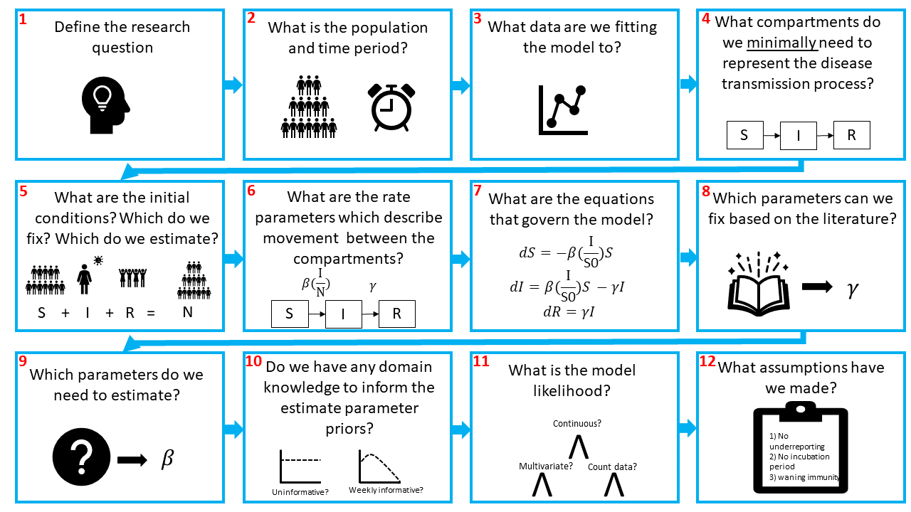
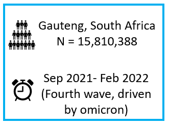
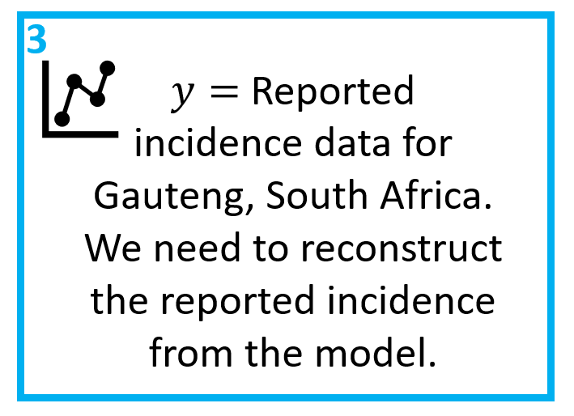
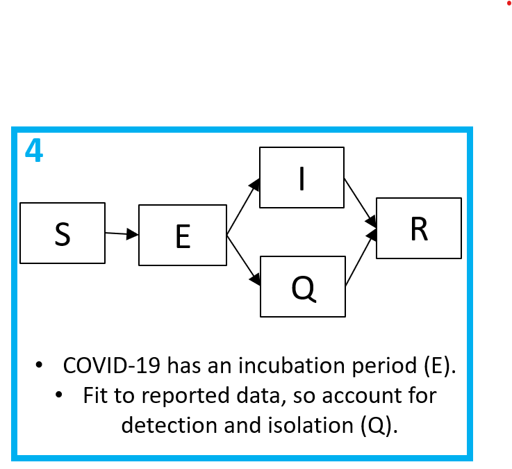
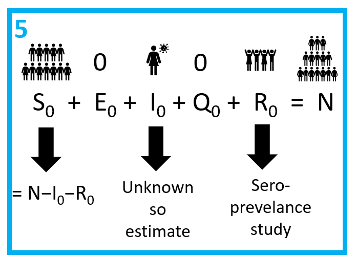
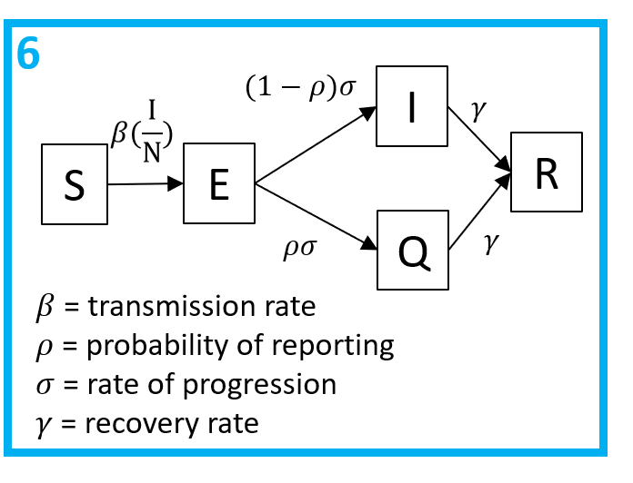
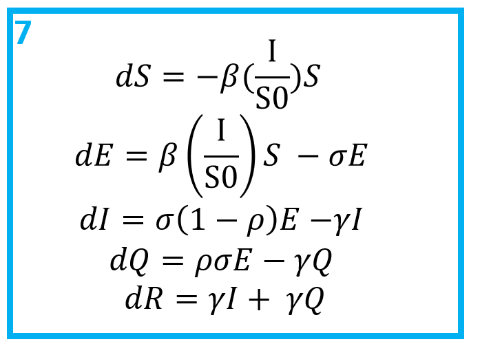
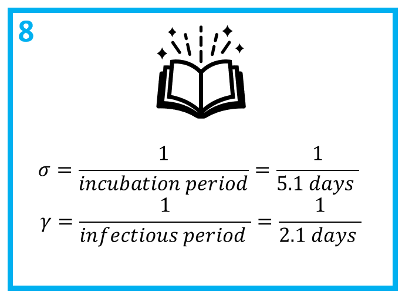
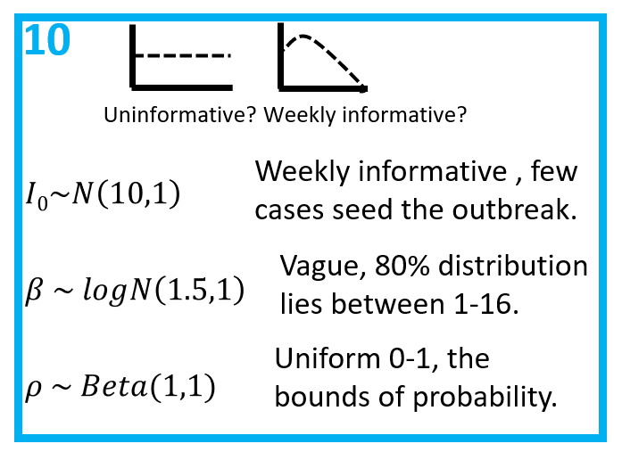

```{r setup, include=FALSE}
knitr::opts_chunk$set(echo = TRUE)
```

# Introduction 

Hi and welcome to the first SARS-CoV-2 model in this exampler. The overall aim of this script is to fit a Susceptible (S) - Exposed (E) - Infectious (I) - Quarantine (Q) - Recovered (R) model to real incidence and genomic data collected in Gauteng, South Africa between late 2021 and early 2022. 


Hopefully, this project will show how we design an infectious disease compartmental model to answer a public health questions. There are many choices to be made along the way so it is important to think about the assumptions we are making so our model is robust. 

##### Some questions include:

- what are the most important disease and epi features?
- how do we represent these features in a model?
- what data do I need?
- what parameters should I estimate? 

As well as designing a model, we will also simulate fake data to check our model works, explore different methods of solving ordinary differential equations (ODEs) in Stan, check our Stan model is fitting well and produce some nice epi curves! 

This code also aims to be reusable, sustainable and testable - important features often overlooked in R! 

First, we need to load some packages. We also need to source the functions needed to run this script, found in the *R* folder. Finally, we need to compile the Stan models, found in the *models* folder. 

```{r message=FALSE, warning=FALSE}

library(rstan)
rstan_options(auto_write = TRUE)           
options(mc.cores = parallel::detectCores())
  
# Functions
source("R/simulate_data.R")
source("R/calc_sim_incidence.R")
source("R/draw_init_values.R")
source("R/run_stan_models.R")
source("R/diagnose_stan_fit.R")
source("R/plot_model_fit.R")

# Models
m1_EU = stan_model("models/model1_Euler_V1.stan")
m1_RK = stan_model("models/model1_RK_V1.stan")
m1_EU2 = stan_model("models/model1_Euler_V2.stan")

```


# Designing our model

**Disclaimer: "all models are wrong. Some models are useful" - George E. P. Box**


First, lets take a look at the storyboard below. It outlines some of the key steps when designing and building a model logically. 


Briefly, we need to define our research question (1), population and time period (2). Then we need to think about what data we will fit our model to (3). Incidence data? Prevalence data?

Next, building the compartmental model (4). Compartmental models are the bread and butter of infectious disease modelling. They are a simple system of differential equations which describe the movement of individuals from one state to another. In the figure we show an SIR model, the most simple model typically used. Individuals in a population start out susceptible to a disease, they have no prior exposure to the disease and so no protective immunity. This is the S compartment. From there, individuals may be exposed and infected by the pathogen, at which point they enter the I compartment. Finally, they recover from the disease and are no longer infectious, they enter the R compartment. 

I will assume you are familiar with compartmental models and so won't go into further detail here. If you are not so familiar, there are lots of good resources out there which already explain SIR models. 

For instance, Imperial has a module on SIR modules on [Coursera](https://www.coursera.org/lecture/developing-the-sir-model/introduction-to-the-sir-model-FXISd?redirectTo=%2Flearn%2Fdeveloping-the-sir-model%3Faction%3Denroll). Or there are an abundance of videos on YouTube where people introduce SIR models, especially since COVID-19. [This](https://www.youtube.com/watch?v=Qrp40ck3WpI) is a nice intro! 

Having designed the model, we need to think about the initial conditions for each state (5). If an infectious agent is entirely new to a population, like SARS-CoV-2 was at the start of 2020, we would expect all of the population to be in the S compartment, with a few individuals in the infectious compartment: 
$$S = N - I_0$$ 

If the in pathogen is not novel, then we might expect some of the population to be in the recovered compartment. Critically, the sum of all the compartments must equal the population, $$S + I + R = N$$ 

The flow between the compartments is governed by rates (6). In this example, we have the transmission rate, typically denoted $\beta$ and the recovery rate, $\gamma$. Note that because transmission depends on the number of infectious people we need to account for this. Hence, the force of infection (the per capita rate that susceptible indviduals contract the infection) depends on the prevalance of infectious people  and the transmission rate:

$$\lambda = \frac{I}{N} \beta$$

Next, converting our model diagram into ODE equations (7). Simply, arrows leading out of a compartment are subtraction and arrows leading into a compartment are addition. 

After that, we need to decide which parameters we want to fix (8) and which we want to estimate (9). This likely depends on the research question and available literature.

As we conducting Bayesian modelling, the next decisions we need to make are about the priors (10) and likelihood (11). Hopefully you are familiar with Bayesian statistics, but if not then I recommend going back to some of the resources suggested at the top, namely A students guide to Bayesian Statistics! 

Briefly, what we are asking is, given the data $y$, what are the most likely parameters $\theta$. *Note, when we talk of parameters here, this refers to those we are estimating, not the fixed parameters*. 

In other words, our posterior is $Pr(\theta|y)$. Bayes rule tells us that:

$$
Pr(\theta | y) \propto Pr(y | \theta) Pr(\theta)
$$

Where, $Pr(y | \theta)$ is the likelihood, or sampling distribution, and $Pr(\theta)$ are our priors. The likelihood tells us how to generate our data $y$, given our model parameters. Our priors allow us to incorporate existing domain knowledge into the model. 

Generally, we want priors to be vague enough to explore all reasonable parameter values whilst preventing the sampler exploring areas of posterior space that are implausible. For instance, say we were to estimate the recovery rate, $\gamma$. $\gamma = \frac{1}{D}$, where $D$ is the duration of infection. We know that this must be a positive number, so we can reflect that in our prior. Moreover, even if we did not know very much about the clinical progression of COVID-19, we know that is an acute infection, not a chronic infection - i.e., people generally recovery within days - weeks. So we would want to explore recovery rates that reflect thus. Allowing the sampler to explore the posterior distribution where $\frac{1}{\gamma}$ is hundreds or even thousands of days is inefficient.

We also need to think about the model likelihood, our data generating process. Essentially, we need to link our model output to the observed data we are fitting to. The distribution we choose to link our model out will depend on the type of data we have, and there often isn't only one choice. 

In infectious disease modelling we often have incidence data (i.e., count data) which we fit using a [Poisson likelihood](https://www.youtube.com/watch?v=H20k1O1zvik&list=PLwJRxp3blEvZ8AKMXOy0fc0cqT61GsKCG&index=27). The Poisson distribution has one parameter, $\lambda$ which is the mean rate of events (i.e. infections) occurring in a fixed time or place. $\lambda$ is both the mean and variance of the Poisson distribution. 


**Q1: If we were to use the Poisson distribution to fit to incidence data, what model output would we fit to?**

**A1: The rate that individuals are infectious, i.e., the rate that they enter the $I$ compartment, $= \beta \frac{I}{N} S$.** 


Alternatively, if we think the data is over-dispersed, that is if we think that the number of secondary infections may vary a lot between individuals or settings then we might want to use a Negative Binomial likelihood. The Negative Binomial distribution extends the Poisson distribution with an additional parameter $\kappa$ which controls the over-dispersion of the distribution. Critically, the variance is now $> \lambda$, whereas the Poisson distribution assumes that the variance $= \lambda$. When $\kappa$ is very small, over-dispersion is high, but when $\kappa$ is large enough, the Negative Binomial distribution converges on the Poisson! 


The final step in building our model is to think about the assumptions we have made along the way. As we said before, no model is perfect. We want our model to be as simple as possible, whilst still capturing the important features of the pathogen. This means we have to make simplifying assumptions in how we represent the transmission process in our compartments. One notable assumption is that everyone in the compartments in homogeneous. Equally, there might be lots of unknowns about the disease or the data, which again means we will have to make assumptions! We can also do sensitivity analyses to explore the impact of our assumptions. 



An important thing to note is that although these may seem like a linear set of steps to building a model, model fitting is far from a linear process! These steps provide a loose guidance for the first iteration of model building, which should be as simple as possible. It is important to be flexible with these steps and to expect to have to go back and make changes to the model once you start fitting to the data. It may be that you realise you need additional data (3), you realise one of your simplifying assumptions (12) doesn't allow you to capture a key aspect of the data and so you amend the model by introducing extra compartments (4). Maybe there is more data available than when you started so you change a fixed parameter value (8) or amend your priors to incorporate additional domain knowledge (10)... you get the idea! 

So, now lets design the model! 

#### Step 1: Define the reseach question


### Step 2: What is the population and time period?

This is partly answered by the research question, we are interested in the population of Gauteng and the period of time when Omicron first emerged.The population of Gauteng is 15,810,388.

We know that Omicron was first detected in October 2021, but we suspect that there was probably some transmission before it was detected, so the start of our modelling period will be September 2021. 

We want to explore the dynamics during the 4th Omicron driven wave. If you look at [this](https://covid19.who.int/region/afro/country/za) dashboard provided by the WHO, we can see that the 4th wave was over by ~February. We will run our model till the 23rd of February to make sure we capture all of the epidemic curve. 



### Step 3: What data are we fitting the model to?

We are going to fit to the *reported* incidence of SARS-CoV-2. 



### Step 4: What compartments do we minimally need to represent the disease transmission process? 

Starting with the SIR model, we want to account for the [incubtion period](https://en.wikipedia.org/wiki/Incubation_period) of COVID-19 and we need to account for only having data on the reported incidence. Therefore, we want to extend the model in some way which allows for individuals to either be detected, reported and isolated or not detected, in which case they carry on as normal and are infectious. 


**Q2: draw out a compartmental model which accounts for the above**


**A2:**



### Step 5: What are the initial conditions? What do we want to estimate? What do we want to fix?

Our population = $N$ = 15810388. We can assume that $E_{t0}$ and $Q_{t0}$ = 0. 

As we are fitting to the 4th wave of SARS-CoV-2 in Gauteng, we know some of the population will already have had an infection and have immunity, so they go in the $R$ compartment. We can look to seroprevalence surveys for data on the percentage of the population with immunity.56.2% of the unvaccinated population of Gauteng had antibodies to SARS-CoV-2 in December 2021 [1]. Note, this is slightly after the emergence of Omicron but it is the best data we have for now. 

So $$R_{t0} = 15,810,388  *  0.562 = 8,885,438$$

We don't know how many initial infections where were or exactly what time period Omicron emerged, so we will estimate $I_{t0}$. 

Finally, $$S_{t0} = N - R_{t0} - I_{t0}$$ 



### Step 6: What are the rate parameters which describe movement between the compartments?




Note, $\beta$, $\sigma$ and $\gamma$ are all per capita rates, whereas $\rho$ is a probability. All individuals will progress to be infectious at an average rate of $\sigma$ and some $\rho$ % will be tested and reported.


### Step 7: What are the equations that govern the model?



Once you have a flow diagram with rates, writing the equations is simple! Arrows out of a state are subtracted, arrows into a stated are added. A good check is to make sure the equations balance. 

### Step 8: Which parameters can we fix based on the literature?



The incubation and infectious period are well defined for previous SARS-CoV-2 variants, and we will assume (at least for now) that they are the same for the new Omicron variant. We therefore assume an average incubation period $1/σ$ of 5.1 days [2] and an average infectious period $1/γ$ of 2.1 days [3]. 

### Step 9: Which parameters do we need to estimate?

By process of elimination, we are going to estiamte $\beta$ and $\rho$. 


**Q3: why would we want to estimate these parameters?**

**A3**


### Step 10: Do we have any domain knowledge to inform the parameter priors?

First, $\rho$, the probability of reporting. $\rho$ must be between 0 and 1, so a [beta](https://en.wikipedia.org/wiki/Beta_distribution) prior is suitable here. For  now, lets assume that any probability of reporting is equally likely and say that $\rho \sim Beta(1,1)$. 


**Q4: use the function `rbeta()` to check that $\rho \sim Beta(1,1)$ provides a uniform distribution between 0 and 1.**


**A4** 
```{r}
samp = rbeta(1000000,1,1)
plot(density(samp))
```
 

For $\beta$ we are not sure how transmissible Omicron is yet, but we think somewhere similar or more transmissible than the Delta variant. A useful measure of transmission is the [Reproduction number](https://en.wikipedia.org/wiki/Basic_reproduction_number) ($R_0$), the average number of secondary cases produced per infectious individual in an susceptible population. The $R_0$ is equal to the rate that individuals are infectious / the rate they recover. For a simple SIR model this would be $R_0 = \frac{\beta}{\gamma}$. For our model $R_0 = \frac{(1-\rho)\beta}{\gamma}$. This can be confirmed using the [next generation matrices method](https://www.ncbi.nlm.nih.gov/pmc/articles/PMC2871801/#:~:text=The%20basic%20reproduction%20number%20%E2%84%9B,categories%20of%20individuals%20are%20recognized), if interested. The $R_0$ of Delta is estimated around 5 [4], so exploring values of $\beta$ that correspond to an $R_0$ of 5 and higher seems reasonable.


**Q5: Define a prior for $\beta$ which supports $R_0$ values between 1 and ~12, given $\rho$ values between 0 and 1.**


**A5**

**$\beta = \frac{R_0 \gamma}{(1-\rho)}$.**

```{r}
R0 = runif(10000,2,12) # draw randomly 10,000 values between 2 and 12 
gamma = 1/5.1
rho = runif(10000,0,1) 

# calculate values of beta 
beta = R0 * gamma / (1-rho) 
 
# 95% quantiles of beta 
quantile(beta, probs = c(0.025,0.975)) 

# draw from a log normal distribution 
beta_prior = rlnorm(10000,0.8,0.5)

# check values of beta support R0 range 
R0_p = (1-rho) * (beta_prior) / gamma

quantile(R0_p,  probs = c(0.025,0.1,0.25, 0.5, 0.75,0.9,0.975))

plot(density(R0_p))
```

**We can see that $\beta \sim Lognormal(0.8,0.5)$ supports $\R0$ values mostly between 1 and 13, but allow for extreme values of $\R0$ if the data supports it.** 


Finally, we will assume that Omicron was seeded by very few individuals given Gauteng: $I_0 \sim Normal(1,5)$. Note, that although this allows for negative values, we can set parameter bounds in Stan which will ensure the seed is positive. 



### Step 11: What is the model likelihood?

SARS-CoV-2 is known to be overdispersed, so we will use a Negative-Binomial likelihood. We will match the reported incidence data to the reported incidence in our model, which is the rate of entry into the $Q$ compartment.Thus, let  $\lambda = \rho \sigma E$. Our likelihood is therefore:

$$ y \sim NegBin(\lambda, \kappa) $$


This means we need to additionally estimate $\kappa$. We will assume  for which we will assume the prior $\kappa \sim exp(0.01)$ which allows for a wide range of values reflecting our uncertainty. 


### Step 12: What assumptions have we made?

These are just some of the assumptions, there are plenty more to think about!

 


**Now we have designed our first infectious disease model, we can get onto coding it! **


# Stan models 

If you aren't familiar with Stan I recommend watching [this](https://www.youtube.com/watch?v=YZZSYIx1-mw&list=PLwJRxp3blEvZ8AKMXOy0fc0cqT61GsKCG&index=72) and [this](https://www.youtube.com/watch?v=a-wydhEuAm0&list=PLwJRxp3blEvZ8AKMXOy0fc0cqT61GsKCG&index=69) for an introduction into coding a Stan model and the Hamiltonian Monte Carlo algorithm - the algorithm which will sample our posterior distribution. 


If you are familiar with Stan then we can move to coding up the infectious disease model. The first thing to note is that there are two ways to solve our ODEs in Stan. 


### Method 1: Euler's Method 


Euler's Method is the simplest numerical integration method. Consider an infectious disease model, where susceptible individuals are infected at rate $\beta$ but never recover! 


 $$\frac{dS}{dt} = - \beta S \frac{I}{N}$$ 
 
 $$\frac{dI}{dt} =  \beta S \frac{I}{N}$$ 
 
To solve this, the Euler's Method calculates the change in compartment during time interval $t$ and predicts the next state at time $t+1$:

$$S_{t+1} = S_t - \beta S_t \frac{I_t}{N}$$

$$I_{t+1} = I_t + \beta S_t \frac{I_t}{N}$$

Assume we have a population $N=100$ and a transmission rate of $ \beta = 1$. The initial conditions are: $I_{t0} = 1$ and $S_{t0} = 99$. 

At $t_1$, we can calculate our states as: 

$$S_{t1} = 99 - 1 . 99 . \frac{1}{100}  =  98.01$$ 


$$I_{t1} = 1 + 1 . 99 . \frac{1}{100} = 1.99$$

At $t_2$, we can calculate our states as: 

$$S_{t1} = 98.01 - 1 . 98.01 . \frac{1.99}{100} = 96.06$$ 

$$I_{t1} = 1.99 + 1 . 99 . \frac{1.99}{100} = 3.94$$

And so on... 


To solve our ODEs in Stan using this method, we can simply use a for loop to solve the equations at each time step and predict the state at the next time step.This method is simple, but its accuracy depends on the time step used. Smaller time steps will get closer to the exact solution. For instance, when fitting a model over the course of a year, day intervals are likely sufficient. If fitting a model over days, then hours would be a more appropriate interval. A benefit of using simulated data, as we will see, is that we can check that our time step is sufficiently small to obtain an accurate approximation of the solution. Depending on the required level of accuracy, the time step needed to obtain an acceptable approximation may be so small as to be computationally expensive. In this instance, higher order methods are used such as the  [Runge-Kutta Method](#RKM). 


**So, to see how we code up the SEIQR model in Stan using Euler's Method, go ahead and open up *model1_Euler_V1.stan*, in the *models* folder.**

You will find a data block, a parameters block, a transformed parameters block a model block and a generated quantities block. 

##### Data block

The data block includes the number of data points we have, as well as the number of time steps to run the model over. These two values aren't the same as we don't expect to have observed the transmission of Omega from the very first day of its emergence. To account for this, we seed our model ($I_{t0}$) a month before we observe data. The time point that we seed Omicron is provided in the data block. 

The data block also contains the parameters and initial conditions we aren't estimating, and of course, our observed data. 

##### Parameters block

This contains the parameters we want to estimate. Note the bounds we put on parameters, which must also be positive and for rho must be between 0 and 1. 

##### Transformed parameters block

This is where we estimate the solution to the ODEs at each time step. We also calculate the reported incidence and extract the time points we are going to fit to. 

##### Model block

This contains the model likelihood and priors.

##### Generated quantities block

This contains code to calculate any other quantities that are not needed for the model block. In this instance, we will calculate $R_0$.


**Take some time to read over the model and check it makes sense.**


### <a id="RKM"></a> Method 2: Runge-Kutta Method

This second method builds on Eulers method, but rather than calculating a single rate of change at each time step, we calculate 4 different slopes. These slopes are then used as a weighted average to approximate the actual rate of change of states. Because we calculate multiple slops at each interval, we obtain a more accurate approximation. For a more detailed visualisation of this method, see [here](https://www.haroldserrano.com/blog/visualizing-the-runge-kutta-method#:~:text=The%20Runge%2DKutta%20Method%20is,uses%20them%20as%20weighted%20averages).  

To implement this method, we use one of Stan's two inbuilt ODE integrators, *integrate_ode_rk45*, which is the faster (but potentially less robust) of the two. Note, Stan issues warning messages if an integrator fails to solve an ODE (although we have never had this issue), at which point the solver may need to be [adjusted](https://mc-stan.org/docs/2_24/stan-users-guide/control-parameters-for-ode-solving.html) or [swapped](https://mc-stan.org/docs/2_24/stan-users-guide/stiff-ode-section.html). We specify the ODE in Stan using a function within, unsurprisingly, the functions block. See the section of [this tutorial](https://mc-stan.org/users/documentation/case-studies/boarding_school_case_study.html#coding_the_ode_in_stan) on coding the ODE in Stan for more details. 

**To see how we code up the SEIQR model in Stan using *integrate_ode_rk45* open up *model1_RK_V1.stan*, in the *models* folder.**

As before, you will find a data block, a parameters block, a transformed parameters block a model block, a generated quantities block, plus a functions block.


# Fitting to simulated data 

Before we fit our model to real data, we will use simulated data to check the model. This is useful to check we have no bugs in our code. Also, even though Stan has lots of helpful diagnostics, we can never be completely certain our sampling algorithm has converged on the true posterior distribution. The diagnostics only confirm when it definitely hasn't. Therefore, using simulated data lets us check that the model can recover known posterior estimates, which gives us more confidence when it comes to fitting data. 

### Defining global parameters 

First, lets set the start and end date over which to fit the model, converted into a date format in R. For more detail on working with dates in R, see [here](https://www.stat.berkeley.edu/~s133/dates.html).  

As mentioned above, we want to seed Omicron 1 month before we fit to data. We can use the date to find what time step this occurs at. 

```{r}
start_date =  as.Date.character("01-09-2021", format = "%d-%m-%Y") 
end_date = as.Date.character("23-02-2022", format = "%d-%m-%Y")
all_dates = seq.Date(from = start_date, to = end_date ,  by = "days") # model times 
ts = 1:length(all_dates)

seed_omicron =  which(all_dates == as.Date.character("01-10-2021", format = "%d-%m-%Y")) 
```

As we are simulating data, we next need to define both the fixed and estimated parameters. 

We are assuming an $R_0$ of 5, as estimated for Delta [4]. We know now that the Omicron $R_0$ is higher than this, but when Omicron first emerged we knew nothing about it. Therefore, our prior knowledge is based on Delta. N.b. we will assume this is the $R_0$ in the absence of testing, so $\beta = R_0 \gamma$. 

```{r}
R0 = 5                            # reproduction number 
immunity = 0.562                  # seroprevalence 
n_pop = 15810388                  # population
n_recov = round(immunity * n_pop) # recovered population
n_inf = 1                         # seed 
rho = 0.4                         # reporting probability
gamma = 1/2.1                     # recovery rate 
sigma = 1/5.1                     # progression rate 
beta = (R0 * gamma)               # transmission rate  
```

### Simulating data 

Next, we simulate our transmission data by solving a set of ODEs using the function *simulate_data*. The model equations are defined in *models/model1_deSolve*. 

The function requires that we provide the % of immunity in the population, the 
initial number of infected individuals, the reporting probability, the transmission rate and the time steps at which to solve the model. We can additionally set the population and recovery and progression rates, if we don't want to use the predefined values. The function will return a data frame of solutions to the derivatives of all compartments at each time step. It will also print the plot of each compartment across time, so we can check everything is behaving as expected! 

```{r message=FALSE, warning=FALSE}
sim_data = simulate_data (
  immunity = immunity, # seroprevalence 
  n_inf = n_inf,       # seed 
  rho = rho,           # reporting probability
  beta = beta,         # transmission rate
  ts = ts              # time steps 
)


```

### Calculating reported incidence 

Then, lets calculate the reported incidence (i.e., the rate that individuals enter the Q compartment, $Inc = \rho  \sigma  Q$). The function *simulated_data* calculates the reported incidence and discards the first month as unobserved transmission. A list is returned which includes the data frame of date and reported incidence and a plot. 


```{r message=FALSE, warning=FALSE}
simulated_data = calc_sim_incidence(
  ODE_data= sim_data,       # ODE solutions
  all_dates = all_dates,    # model dates
  date_seed = seed_omicron, # time step to seed omicron 
  rho = rho                 # reporting probability 
)

rep_inc = simulated_data[[1]]
simulated_data[[2]] # plot of reported incidence 
```


## Model fitting

The next step is to run the Stan model using the function *run_stan_models*.

The very minimum we need to input into this function to fit the model is:

- The data (in list format)
- The compiled Stan model

We can also provide other arguments if we want to:

- A vector of seed values used when randomly selecting initial values for the Markov chains^. The number of seeds must be equal to the number of Markov chains and must all take different values. 
- Number of chains to run. 
- Number of iterations per chain. 
- Number of warmup iterations per chain. 

^ **A note on choosing initial values.** The MCMC algorithm needs starting points for each chain. If no initial values are given, Stan will randomly generate values betwen -2 and 2. On the other hand, setting initial values that are likely under the posterior distribution can help model convergence, especially as model complexity increases (including non-linear systems of ODEs). We want the initial values to be different, so we can see that the Markov chains are converging, however we also want them to within a plausible range. To do this, we create a function called *draw_init_values* which randomly draws a sample from a uniform distribution, whose bounds cover a reasonable range of expected parameter values. If we don't set the seed, t will be 1 and we will always obtain the same initial values. Instead, the function *run_stan_models* calls *draw_init_values* and uses seed values to create a list of values using different seeds, so we have 3 different starting values for each chain.*

Running this function will fit our Stan model to the simulated data and return the fitted results. It also prints the model run time, which will be useful as model complexity increases. 

### Fitting using the Euler method 

First, we are going to fit the model using the Euler method: 

```{r}

stan_fit_EU = run_stan_models(
  list_data =
    list(
      n_ts = length(all_dates), # no. time steps 
      n_pop = n_pop,            # population
      n_recov = n_recov,        # recovered population 
      y = rep_inc$rep_inc,      # incidence data 
      n_data = dim(rep_inc)[1], # no. data
      sigma = sigma,            # progression rate       
      gamma = gamma,            # recovery rate 
      time_seed_omicron = seed_omicron # time point to seed omicron
    ), 
  model = m1_EU 
)
```

Note, our function returns the the time taken to run the model which will be useful when we are comparing methods to solve the ODEs. 

#### Model diagnostics 

If there are divergent transitions, Stan will warn us. Check out what divergent transitions are and why they can *never* be ignored [here](https://mc-stan.org/docs/2_29/reference-manual/divergent-transitions.html). Good news however, we obtained no immediate warnings about our model!
To be on the safe side, lets check with some model diagnostics. *diagnose_stan_fit* takes our fitted Stan results and returns diagnostics plots and a table of summary statistics. 


```{r message=FALSE, warning=FALSE}
EU_diag = diagnose_stan_fit(stan_fit_EU, pars = c("beta", "rho", "I0"))

EU_diag
```

The first output shows the bivariate marginal posterior distribution which will show divergent transitions in red, if there are any. Note also, the strong correlation between parameters. The next outputs show markov chain trace plots to check for model convergence and univariate marginal posterior distribution by chain. 

Finally, the function also returns a summary of the parameters we are interested in. This includes the mean and median, as well [Credible intervals](https://www.youtube.com/watch?v=wMfODgwqEr0&list=PLwJRxp3blEvZ8AKMXOy0fc0cqT61GsKCG&index=23) (CrI). Other useful statistics are given including the [effective sample size](INSERT LINK) and [Rhat](INSERT LINK).


#### Plotting the model fit 

We want to plot the model output against the true data so we can see whether our model is fitting the data well. We use the function *plot_model_fit* which requires as input the stan fit, the simulated data and the name of the parameter we fit, in this instance lambda (our reported incidence). 

When we first extract the model posterior and convert it into a dataframe (the object names *stan_fit_df* in the function), the first column is the iterations,  the second is the time step and the the third is the estimated value (reported incidence). 

The function allow us to calculate the mean and 95% CrI, which are the 2.5% and 97.5% percentiles. Remember, credible intervals state that given the observed data, there is a 95% probability the value falls between this range.

We then plot these against our simulated data, over time.

```{r message=FALSE, warning=FALSE}
EU_plot = plot_model_fit(stan_fit_EU, variable_model = "lambda", variable_data = "rep_inc",  rep_inc)

EU_plot
```


### Fitting using the Runge-Kutta Method

**Q6: Using the functions *run_stan_models*, *diagnose_stan_fit* and *plot_model_fit*, fit the *model1_RK* to the simulated data** 


**A6:**

**We need to change the data slightly, to include a vector of time steps at which to solve the model.** 

```{r}
stan_fit_RK = run_stan_models(
  list_data =
    list(
      n_ts = length(all_dates),         # no. time steps 
      n_pop = n_pop,                    # population
      n_recov = n_recov,                # recovered population 
      y = rep_inc$rep_inc,              # incidence data 
      n_data = dim(rep_inc)[1],         # no. data 
      sigma = sigma,                    # progression rate  
      gamma = gamma,                    # recovery rate 
      time_seed_omicron = seed_omicron, # time point to seed omicron 
      ts = 1:length(all_dates)          # time steps 
    ), 
  model = m1_RK 
)
```

**Diagnostics still look good.**
```{r}
RK_diag = diagnose_stan_fit(stan_fit_RK, pars = c("beta", "rho", "I0"))
RK_diag
```

**As does the model plot.**
```{r}
RK_plot = plot_model_fit(stan_fit_RK, "lambda", "rep_inc", rep_inc)

RK_plot
```


**Q7: Which method is fastest? By how much?**

**A7: the Euler method is ~9 x faster**

**Q8: Which method recovers the true parameters best? Why do we get good fits for both models but different parameter estimates? **

**A8: Lets plot our original values, alongside our estimated values**
  

```{r}

true_param = data.frame(names = pars,
                  mean = c(beta, rho, n_inf))

EU_param = data.frame(names = pars, 
  EU_diag[[3]][,c(1,4,8)])

RK_param = data.frame(names = pars, 
  RK_diag[[3]][,c(1,4,8)])

param_df = true_param  %>% 
bind_rows(EU_param) %>% 
  bind_rows(RK_param) %>%  
   rename(lower = "X2.5.", upper = "X97.5.") %>% 
  mutate(model = c(rep("true", 3), rep("Euler", 3), rep("RK",3))) 

# plot rho 
param_df %>% 
  filter(names == "rho") %>% 
ggplot(aes(x=names, y = mean))+
  geom_point(aes(color = model), position = position_dodge(width = 0.5)) +
  geom_errorbar(aes(ymin = lower, ymax = upper, color = model),
                   position = position_dodge(width = 0.5), width =  0.4, size = 1) +
  ylab("parameter estimate")
  

# plot I0 
param_df %>% 
  filter(names == "I0") %>% 
ggplot(aes(x=names, y = mean))+
  geom_point(aes(color = model), position = position_dodge(width = 0.5)) +
  geom_errorbar(aes(ymin = lower, ymax = upper, color = model),
                   position = position_dodge(width = 0.5), width =  0.4, size = 1) +
  ylab("parameter estimate")


# plot beta 
param_df %>% 
  filter(names == "beta") %>% 
ggplot(aes(x=names, y = mean))+
  geom_point(aes(color = model), position = position_dodge(width = 0.5)) +
  geom_errorbar(aes(ymin = lower, ymax = upper, color = model),
                   position = position_dodge(width = 0.5), width =  0.4, size = 1) +
  ylab("parameter estimate")
```

**Both methods recover the parameter estimate for $\rho$, although the Euler method is subject to more uncertainty. The RK method is also more accurate than the Euler method at recovering the values for $\beta$ and $I_0$. Remember that the bivariate marginal posterior distributions plots for both methods showed strong correlation between $\beta$, $\rho$ and $I0$, indicating the uncertainty in these parameter's posteriors are correlated given the data. It is also important to remember that the data is generated using a single parameter value, whereas in Bayesian modelling we consider parameters to be distributions, not fixed values. This highlights the limitations of using a single simulated data set, how do we decide if the posterior distribution is close enough to the "correct" value? Nevertheless, we can see that the RK method is more accurate than the Euler method** 

## Improving the accuracy of the Euler method 

**Q9: Reduce the time step at which *model1_Euler_V1.stan* solves the ODEs to improve the accuracy of the fit** 


**A9: *model1_Euler_V2.stan* modifies the original model to allow us to estiamte the ODE solutions at a scaled time step, which is smaller than 1 day. We now just need to provide an additional data variable, the amount to scale by.**

**We also divide all the *rate* parameters by our scaling factor, as $\sigma$ and $\gamma$ are in days. We do this in the transformed data block.**

**Once we have solved the model at our desired resolution, we need to aggregate the reported incidence back into days. They way we do this is using a for loop which adds to the index as it runs**


```{r}

# run the model 

stan_fit_EU2 = run_stan_models(
  list_data =
    list(
      n_ts = length(all_dates),         # no. time steps 
      n_pop = n_pop,                    # population
      n_recov = n_recov,                # recovered population 
      y = rep_inc$rep_inc,              # incidence data 
      n_data = dim(rep_inc)[1],         # no. data 
      sigma = sigma,                    # progression rate  
      gamma = gamma,                    # recovery rate 
      time_seed_omicron = seed_omicron, # time point to seed omicron 
      scale_time_step = 2               # amount to reduce time step
    ), 
  model = m1_EU2 
)


```

**Let's check the diagnostics now and see if we are able to improve the accuracy. **

```{r}
diagnose_stan_fit(stan_fit_EU2, pars = c("beta", "rho", "I0"))
```


```{r}
plot_model_fit(stan_fit_EU, "lambda", sim_data)
```

# Fitting to real data 

Now that we are confident in our models fitting to simulated data, lets fit to real observed data! As mentioned above, we are initially going to assume that all reported incidence during the modelling period in Gauteng is Omicron. 

We can get data on the reported incidence from GitHub, we just need to filter by date. 

**Activity: fit both model variations to the real data. N.b. use the second version of the Euler model, where we reduce the time step to improve accuracy (*model1_EU2* and *model1RK*)** 


# References 

- (1) Madhi SA, Kwatra G, Myers JE, et al. Population Immunity and Covid-19 Severity with Omicron Variant in South Africa. N Engl J Med 2022; 386(14): 1314-26.
- (2) Lavezzo E, Franchin E, Ciavarella C, et al. Suppression of a SARS-CoV-2 outbreak in the Italian municipality of Vo’. Nature 2020; 584(7821): 425-9.
- (3) McAloon C, Collins Á, Hunt K, et al. Incubation period of COVID-19: a rapid systematic review and meta-analysis of observational research. BMJ Open 2020; 10(8): e039652.
- (4) Liu, Y. & Rocklov, J. The reproductive number of the Delta variant of SARS-CoV-2 is far higher compared to the ancestral SARS-CoV-2 virus. J Travel Med 28, doi:10.1093/jtm/taab124 (2021).
