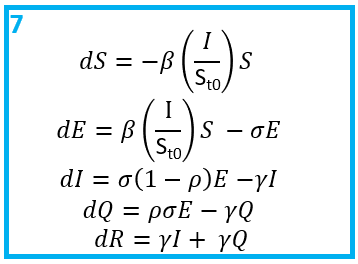
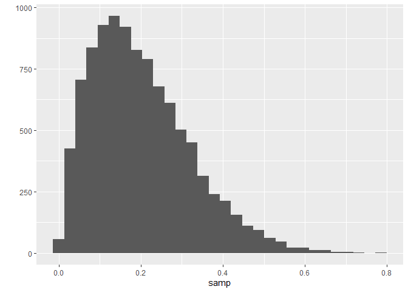

  

Hi and welcome to the chapter in this exampler on designing an infectious disease model. The overall aim of this script is to design a Susceptible (S) - Exposed (E) - Infectious (I) - Quarantine (Q) - Recovered (R) model to explore the transmission dynamics of Omicron in Gauteng, South Africa between late 2021 and early 2022. 


This script show step by step how to design an infectious disease compartmental model to answer a public health question. There are many choices to be made along the way, so it is important to think about the assumptions we are making so our model is robust. 

Some questions include:

- What are the most important disease and epidemiological features?
- How do we represent these features in a model?
- What data do is needed to calibrate the model?
- What parameters should be estimated? 


**Disclaimer: "all models are wrong. Some models are useful" - George E. P. Box**

# Introduction to infectious disease modelling 

First, lets take a look at the storyboard below. It outlines some of the key steps when designing and building a model logically. 

![Designing a compartmental model.] 


Briefly, we need to define (1) our research question, (2) population and time period. Then we need to think about (3) how our model can reproduce the observed data. Are we modelling incidence or prevalence data?

Next, we need to (4) design the compartmental model. Compartmental models are the bread and butter of infectious disease modelling. They are a system of differential equations which describe the flows of individuals from one infectious state to another and represent the infection history. In the figure we show an SIR model, the most simple model typically used. In this model we often assume that individuals in a population start out susceptible to a disease, i.e.,  they have no prior protective immunity. This is the S compartment. From there, individuals may be infected by the pathogen, at which point they are also infectious and enter the I compartment. Finally, when they recover from the disease and are no longer infectious, they enter the R compartment. 

I will assume you are familiar with compartmental models and so won't go into further detail here. If you are not so familiar, there are lots of good resources out there which already explain SIR models. 

For instance, Imperial has a module on SIR modules on [Coursera](https://www.coursera.org/lecture/developing-the-sir-model/introduction-to-the-sir-model-FXISd?redirectTo=%2Flearn%2Fdeveloping-the-sir-model%3Faction%3Denroll). Or there are an abundance of videos on YouTube where people introduce SIR models, especially since COVID-19. [This](https://www.youtube.com/watch?v=Qrp40ck3WpI) is a nice intro! 

Having designed the model, we need to (5) think about the initial conditions for each state. If an infectious agent is entirely new to a population, like SARS-CoV-2 was at the start of 2020, we would expect all of the population to be in the S compartment, with a few individuals in the infectious compartment: 
$$S = N - I_0$$ 

If the in pathogen is not novel and there is prior immunity, then we might expect some of the population to be in the recovered compartment. Critically, the sum of all the compartments must equal the population size, $$S + I + R = N$$ 

The flow between the compartments is governed by rates (6). In this example, we have the transmission rate, typically denoted $\beta$ and the recovery rate, $\gamma$. Note that because transmission depends on the number of infectious people we need to account for this. Hence, the force of infection (the per capita rate that susceptible individuals contract the infection) depends on he transmission rate and on the proportion of the population that is infectious:
$$\lambda = \beta\frac{I}{N} $$

Next, we need to (7) convert our flow diagram into ODE equations. Simply, arrows leading out of a compartment represent subtractions and arrows leading into a compartment represent additions. 

After that, we need to decide (8) which parameters we want to fix and (9) which we want to estimate. This likely depends on the research question and available data and parameter estimates in the literature.

As we are fitting the model using Bayesian inference, the next decisions we need to make are about the priors (10) and likelihood (11). Hopefully you are familiar with Bayesian statistics, but if not then I recommend going back to some of the resources suggested in the [README.md](https://github.com/bnc19/ReCoDE_IDMS). 

Briefly, what we are asking is, given the data $y$, what are the most likely parameters $\theta$. *Note, when we talk of parameters here, this refers to those we are estimating, not the fixed parameters*. 

In other words, our posterior distribution is $Pr(\theta|y)$. Bayes rule tells us that:

$$
Pr(\theta | y) \propto Pr(y | \theta) Pr(\theta)
$$

Where, $Pr(y | \theta)$ is the likelihood, or sampling distribution, and $Pr(\theta)$ is our prior distribution. The likelihood tells us how to generate our data $y$, given our model parameters. Our prior distributions allow us to incorporate existing domain knowledge into the model. 

Flat (i.e., uniform priors) and "uninformative" priors are discouraged in Stan, so we are going to avoid them. Ben Lambert explains [here](https://www.youtube.com/watch?v=5xNRroKo7u8&list=PLwJRxp3blEvZ8AKMXOy0fc0cqT61GsKCG&index=40) why priors are, depending on the frame of reference, never completely uninformative. Instead, we want prior distributions to be vague enough to explore all reasonable parameter values whilst preventing the sampler exploring areas of the parameter space that are implausible. For instance, say we were to estimate the recovery rate, $\gamma$. $\gamma = \frac{1}{D}$, where $D$ is the average duration of the infection. We know that this must be a positive number, so we can reflect this in our prior distribution. Moreover, even if we did not know very much about the clinical progression of COVID-19, we know that is an acute infection, not a chronic infection - i.e., people generally recovery within days - weeks. So we would want to explore recovery rates that reflect this. Allowing the sampler to explore the posterior distribution where $\frac{1}{\gamma}$ is hundreds or even thousands of days would be inefficient.

For more detail on choosing prior values take a look at this [post](https://github.com/stan-dev/stan/wiki/Prior-Choice-Recommendations) written by Andrew Gelman, one of the developers of Stan.

We also need to think about the model likelihood, which aims to capture the data generating process. Essentially, we need to link the chosen model output to the data we are fitting the model to. The distribution we choose to link our model output depends on the type of data we have, and there often isn't only one choice. 

In infectious disease modelling we often have incidence data, which we may want to fit using a [Poisson likelihood](https://www.youtube.com/watch?v=H20k1O1zvik&list=PLwJRxp3blEvZ8AKMXOy0fc0cqT61GsKCG&index=27). The Poisson distribution has one parameter, $\lambda$ which represents the mean rate of the event (in this case, infections) occurring in a fixed time and the variance. 

**Q1: If we were to use the Poisson distribution to fit to incidence data, what model output would we fit to?**

**A1: The rate that individuals become infectious, i.e., the rate that they enter the $I$ compartment, $= \beta \frac{I}{N} S$.** 


Alternatively, if the data are over-dispersed, that is if the variance is larger than the mean then we might want to use a Negative Binomial likelihood. The Negative Binomial distribution extends the Poisson distribution with an additional parameter $\kappa$ which controls the over-dispersion of the distribution. Critically, the variance is now $> \lambda$. When $\kappa$ is very small, over-dispersion is high, but when $\kappa$ is large enough, the Negative Binomial distribution converges on the Poisson! 


The final step in building our model is to think about the assumptions we have made along the way. As we said before, no model is perfect. We want our model to be as simple as possible, whilst still capturing the important features of the pathogen. This means we have to make simplifying assumptions in how we represent the transmission process in our compartments. One notable assumption is that everyone in each compartment is assumed to be homogeneous. Equally, there might be lots of unknowns about the disease or the data, which again means we will have to make assumptions! We can also do sensitivity analyses to explore the impact of our assumptions. 

An important thing to note is that although the steps in building a model may appear linear, model fitting is far from a linear process. These steps provide a loose guidance for the first iteration of model building, which should be as simple as possible. It is important to be flexible with these steps and to expect to have to go back and make changes to the model once you start fitting to the data. It may be that you realise you need additional data (3), you realise one of your simplifying assumptions (12) doesn't allow you to capture a key aspect of the data and so you amend the model by introducing extra compartments (4). Maybe there is more data available than when you started so you change a fixed parameter value (8) or amend your priors to incorporate additional domain knowledge (10)... you get the idea. 

So, now lets design the model. 


#  Step 1: Define the reseach question

There may be multiple questions you want to answer in an analysis, and listing them helps you keep the focus. In this example, one of the key questions is: What is the reproduction number of the Omicron variant of concern?

# Step 2: What is the population and time period?

This is partly answered by the research question, we are interested in the population of Gauteng and the period of time when Omicron first emerged.The population of Gauteng is 15,810,388 people.

We know that Omicron was first detected in October 2021, but we suspect that there was probably some transmission before it was detected, so the start of our modelling period will be September 2021. 

We want to explore whether we can reconstruct the dynamics observed in the Omicron wave. If you look at [this](https://covid19.who.int/region/afro/country/za) dashboard provided by the WHO, we can see that this 4th wave was over by ~February. We will run our model till the 23rd of February to make sure we capture all of the epidemic curve. 


# Step 3: What data are we fitting the model to?

We are going to fit to the *reported* incidence of SARS-CoV-2 for Gauteng, South Africa. We need to reconstruct the reported incidence from the model. 


# Step 4: What compartments do we minimally need to represent the disease transmission process? 

Starting with the SIR model, we want to account for the [incubation period](https://en.wikipedia.org/wiki/Incubation_period) of COVID-19 and we need to account for only having data on the reported incidence. Therefore, we want to extend the simple SIR model in some way which allows for individuals to either be detected, reported and isolated or not detected, in which case they remain infectious and are not isolated for the whole duration of the infection. 


**Q2: draw out a compartmental model which accounts for the above**


# Step 5: What are the initial conditions? What do we want to estimate? What do we want to fix?

Our population = $N$ = 15810388. We can assume that $E_{t0}$ and $Q_{t0}$ = 0. 

As we are fitting to the 4th wave of SARS-CoV-2 in Gauteng, we know some of the population will already have had an infection and have immunity, so they go in the $R$ compartment. We can look to seroprevalence surveys for data on the percentage of the population with immunity.56.2% of the unvaccinated population of Gauteng had antibodies to SARS-CoV-2 in December 2021 [1]. Note, this is slightly after the emergence of Omicron but it is the best data we have for now. So:

$$R_{t0} = 15,810,388  *  0.562 = 8,885,438$$ 

For this tutorial, we will assume that the initial number of infections  $I_{t0} = 1$, however as the true number of infections is an unobserved quantity, this is often a parameter value to be estimated. 

Finally, $$S_{t0} = N - R_{t0} - I_{t0}$$ 

# Step 6: What are the rate parameters which describe flows between the compartments?


Note, $\beta$, $\sigma$ and $\gamma$ are all per capita rates, whereas $\rho$ is a probability. All individuals will progress to be infectious at an average rate of $\sigma$ and a proportion $\rho$ will be tested, reported and quarantined.


# Step 7: What are the equations that govern the model?



Once you have a flow diagram with rates, writing the equations is simple! Arrows out of a state are subtracted, arrows into a stated are added. A good check is to make sure the equations balance. 

# Step 8: Which parameters can we fix based on the literature?

We will assume an average latent period $\frac{1}{\sigma}$ of 3.03 days, as estimated for Omicron [2] and an average infectious period $\frac{1}{\gamma}$ of 4.17 days [3]. 

# Step 9: Which parameters do we need to estimate?

Having fixed the generation time (i.e., $\sigma$ and $\gamma$), we are going to estimate $\beta$ and $\rho$. 

**Q3: why would we want to estimate these parameters?**


# Step 10: Do we have any domain knowledge to inform the parameter priors?

As stated above, we want to choose weakly informative priors in order to include enough information to regularise the model. 

One way to achieve this, is to not use hard bounds, unless there are true constrains. For example, $\rho$, is the probability of reporting which *must* be between 0 and 1, therefore using a [beta](https://en.wikipedia.org/wiki/Beta_distribution) prior is suitable here. If we thought that every value of $\rho$ was equally likely, we could set a prior $\rho \sim Beta(1,1)$. As it is, a sero-survey from Gauteng, South Africa in January 2021 estimated a 2-20 fold underreporting of cases, corresponding to a reporting rate <50% [5]. Therefore, lets assume a prior that supports values below 50%, but still allows for higher values if the data support it: $\rho \sim Beta(2,8)$. 


**Q4: use the function `rbeta()` to check the distribution of $\rho \sim Beta(2,8)$** 

**A4** 

```r
samp = rbeta(10000,2,8)
qplot(samp)
```

<!-- -->


Another way to explore the shape of distributions is the [distribution zoo](https://ben18785.shinyapps.io/distribution-zoo/), created by Ben Lambert and Fergus Cooper. 

For the $\beta$ parameter, we are not sure how transmissible Omicron is yet, but we think somewhere similar or more transmissible than the Delta variant. A useful measure of transmission is the [Reproduction number](https://en.wikipedia.org/wiki/Basic_reproduction_number) ($R_0$), the average number of secondary cases produced per infectious individual in an susceptible population. The $R_0$ for a simple SIR model is equal to the transmission rate multiplied by the average duration of the infectious period. For a simple SIR model this would be:

$$R_0 = \frac{\beta}{\gamma}$$ 

For our model: 

$$R_0 = \frac{(1-\rho)\beta}{\gamma}$$
Intuitively, this is due to the fact that only a proportion $(1-\rho)$ of subjects contribute to onwards transmission. More formally, this can also be demonstrated using the [next generation matrices method](https://www.ncbi.nlm.nih.gov/pmc/articles/PMC2871801/#:~:text=The%20basic%20reproduction%20number%20%E2%84%9B,categories%20of%20individuals%20are%20recognized), if interested. The $R_0$ of Delta is estimated around 5 [4], so exploring values of $\beta$ that correspond to $R_0$ estimates around 5 and above seems reasonable.


**Q5: Define a prior for $\beta$ which supports $R_0$ values around 5 but allows for higher values if the data supports it, given $\rho$ values between 0 and 0.5.**


**A5**

**$\beta = \frac{R_0 \gamma}{(1-\rho)}$.**


```r
set.seed(12)
R0 = runif(10000,4,10) # draw randomly 10,000 values between 4 and 10 
gamma = 1/4.17
rho = runif(10000,0,0.5) 

# calculate values of beta 
beta = R0 * gamma / (1-rho) 
 
# 95% quantiles of beta 
quantile(beta, probs = c(0.025,0.5,0.975)) 
```

```
##     2.5%      50%    97.5% 
## 1.156041 2.236819 4.067416
```

```r
# draw from a  normal distribution 
beta_prior = rnorm(10000,2.2,1)
qplot(beta_prior)
```

<!-- -->

```r
# check values of beta support R0 range 
R0_p = (1-rho) * (beta_prior) / gamma

quantile(R0_p,  probs = c(0.025,0.1,0.25, 0.5, 0.75,0.9,0.975))
```

```
##       2.5%        10%        25%        50%        75%        90%      97.5% 
##  0.7447701  2.7193864  4.5400148  6.6724047  9.0758795 11.4707453 14.2731938
```

```r
qplot(R0_p)
```

<!-- -->

**We can see that $\beta \sim ND(2.2,1)$ supports $R_0$ values mostly between 4 and 10, but allow for extreme values of $R_0$ if the data supports it.** 


# Step 11: What is the model likelihood?


SARS-CoV-2 is known to be overdispersed, so we will use a Negative-Binomial likelihood. We will match the reported incidence data to the reported incidence in our model, which is the rate of entry into the $Q$ compartment. Thus, let  $\mu = \rho \sigma E$. Our likelihood is therefore:

$$ y \sim NegBin(\mu, \kappa) $$


This means we need to additionally estimate $\kappa$. We will assume for which we will assume the prior $\kappa \sim exp(0.01)$ which allows for a wide range of values reflecting our uncertainty. 


# Step 12: What assumptions have we made?

Some of the assumptions include:

* All reported incidence cases are due to the Omicron variant
* No waning immunity
* No vaccination
* No pre-symptomatic transmission
* All tested individuals isolate with 100% compliance


# The final model 


**Now we have designed our first infectious disease model, the next step is to code it up in Stan, which we will do in chapter 2. ** 

# References 


- (1) Madhi SA, Kwatra G, Myers JE, et al. Population Immunity and Covid-19 Severity with Omicron Variant in South Africa. N Engl J Med 2022; 386(14): 1314-26.
- (2) Tanaka H, Ogata T, Shibata T, et al. Shorter Incubation Period among COVID-19 Cases with the BA.1 Omicron Variant. Int J Environ Res Public Health 2022; 19(10).
- (3) Lavezzo E, Franchin E, Ciavarella C, et al. Suppression of a SARS-CoV-2 outbreak in the Italian municipality of Vo’. Nature 2020; 584(7821): 425-9.
- (4) Liu, Y. & Rocklov, J. Liu Y, Rocklov J. The reproductive number of the Delta variant of SARS-CoV-2 is far higher compared to the ancestral SARS-CoV-2 virus. J Travel Med 2021; 28(7).
- (5) Mutevedzi PC, Kawonga M, Kwatra G, et al. Estimated SARS-CoV-2 infection rate and fatality risk in Gauteng Province, South Africa: a population-based seroepidemiological survey. Int J Epidemiol 2022; 51(2): 404-17.
