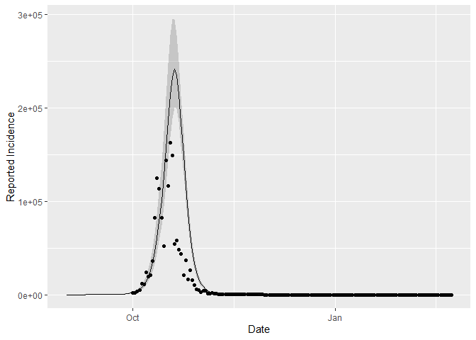

In this chapter, we are going to fit the single variant model designed in chapter 1, using Stan. 

First, we need to load some packages. We also need to source the functions needed to run this script, found in the *R* folder. Finally, we need to compile the Stan models, found in the *models* folder. 


```r
library(dplyr)
library(ggplot2)
library(rstan)
rstan_options(auto_write = TRUE)           
options(mc.cores = parallel::detectCores())
  
# Functions
source("R/simulate_data.R")
source("R/calc_sim_incidence.R")
source("R/draw_init_values.R")
source("R/run_stan_models.R")
source("R/diagnose_stan_fit.R")
source("R/plot_model_fit.R")
source("R/compare_param_est.R")
source("R/tidy_data.R")

# Models
m1_EU = stan_model("models/model1_Euler_V1.stan")
m1_RK = stan_model("models/model1_RK_V1.stan")
m1_EU2 = stan_model("models/model1_Euler_V2.stan")
```


# Simulating data 

In this project, we are going to use simulated data. This is useful to check we have no bugs in our code. Also, even though Stan has lots of helpful diagnostics, we can never be completely certain our sampling algorithm has converged on the true posterior distribution. The diagnostics only confirm when it definitely hasn't. Therefore, using simulated data lets us check that the model can recover known posterior estimates, which gives us more confidence when it comes to fitting to observed data. 

### Defining global parameters 

First, lets set the start and end date over which to fit the model, converted into a date format in R. For more detail on working with dates in R, see [here](https://www.stat.berkeley.edu/~s133/dates.html).  

As mentioned, we want to seed Omicron 1 month before we fit to data, so we can define that here too. 


```r
date_seed_omicron =  as.Date.character("01-09-2021", format = "%d-%m-%Y") 
end_date = as.Date.character("23-02-2022", format = "%d-%m-%Y")
all_dates = seq.Date(from = date_seed_omicron, to = end_date ,  by = "days") # model times
date_fit_omicron =as.Date.character("01-10-2021", format = "%d-%m-%Y")
ts = 1:length(all_dates)
```

As we are simulating data, we next need to define both the fixed and estimated parameters. 

We are assuming an $R_0$ of 5 and and that $\rho$ is 0.2.


```r
R0 = 5                            # reproduction number 
immunity = 0.562                  # seroprevalence 
n_pop = 15810388                  # population
n_recov = round(immunity * n_pop) # recovered population
n_inf = 1                         # seed 
rho = 0.2                         # reporting probability
gamma = 1/4.17                    # recovery rate 
sigma = 1/3.03                    # latent rate 
beta = (R0 * gamma) / (1-rho)     # transmission rate  
```


Next, we simulate our transmission data by solving a set of ODEs using the function *simulate_data_single_var*. The model equations are defined in *models/model1_deSolve*. 

The function requires that we provide the % of immunity in the population, the initial number of infected individuals, the reporting probability, the transmission rate and the time steps at which to solve the model. We can additionally set the population and recovery and latent rates, if we don't want to use the predefined values. The function will return a data frame of solutions to the derivatives of all compartments at each time step. It will also print the plot of each compartment across time, so we can check everything is behaving as expected. 


```r
sim_data = simulate_data_single_var (
  immunity = immunity, # seroprevalence 
  n_inf = n_inf,       # seed 
  rho = rho,           # reporting probability
  beta = beta,         # transmission rate
  ts = ts              # time steps 
)
```

<!-- --><!-- --><!-- --><!-- --><!-- -->

### Calculating reported incidence and adding noise to the data 

Next we calculate the reported incidence (i.e., the rate that individuals enter the Q compartment, $\mu = \rho  \sigma  Q$). The function *calc_sim_incidence_single_var* calculates the reported incidence and discards the first month as unobserved transmission. It also uses the function *rnbinom* to add noise to our simulated data by drawing from a Negative Binomial distribution with a mean $\mu$ and a dispersion parameter $\kappa = 10$. 
A list is returned which includes a data frame containing the date and the reported incidence (with and without noise). It also a returns a plot of the reported incidence with and without noise. 


```r
simulated_data = calc_sim_incidence_single_var(
  ODE_data= sim_data,         # ODE solutions
  all_dates = all_dates,      # model dates
  date_fit= date_fit_omicron, # date to seed omicron 
  rho = rho                   # reporting probability 
)

sim_inc = simulated_data[[1]]
simulated_data[[2]] # plot of reported incidence with and without noise
```

<!-- -->


The reported incidence with noise is what we will fit the Stan models to. 

# Model fitting 


If you aren't familiar with Stan I recommend taking a look at some of the extra materials suggested in the [README.md](https://github.com/bnc19/ReCoDE_IDMS). You should also watch [this](https://www.youtube.com/watch?v=YZZSYIx1-mw&list=PLwJRxp3blEvZ8AKMXOy0fc0cqT61GsKCG&index=72) and [this](https://www.youtube.com/watch?v=a-wydhEuAm0&list=PLwJRxp3blEvZ8AKMXOy0fc0cqT61GsKCG&index=69) for an introduction into coding a Stan model and the Hamiltonian Monte Carlo algorithm - the algorithm which will sample our posterior distribution. 


If you are familiar with Stan then we can move to coding up the infectious disease model. The first thing to note is that there are two ways to solve our ODEs in Stan. 


## Method 1: Euler's Method 


Euler's Method is the simplest numerical integration method. Consider an infectious disease model, where susceptible individuals are infected at rate $\beta \frac{I}{N}$ but never recover. 


 $$\frac{dS}{dt} = - \beta S \frac{I}{N}$$ 
 
 $$\frac{dI}{dt} =  \beta S \frac{I}{N}$$ 
 
To solve this, we calculates the change in compartments during time interval $t$ and predict the next state at time $t+1$:

$$S_{t+1} = S_t - \beta S_t \frac{I_t}{N}$$

$$I_{t+1} = I_t + \beta S_t \frac{I_t}{N}$$

Assume we have a population $N=100$ and a transmission rate of $\beta = 1$. The initial conditions are: $I_{t0} = 1$ and $S_{t0} = 99$. 

At $t_1$, we can calculate our states as: 

$$S_{t1} = 99 - 1 * 99 * \frac{1}{100}  =  98.01$$ 


$$I_{t1} = 1 + 1 * 99 * \frac{1}{100} = 1.99$$

At $t_2$, we can calculate our states as: 

$$S_{t1} = 98.01 - 1 * 98.01 * \frac{1.99}{100} = 96.06$$ 

$$I_{t1} = 1.99 + 1 * 99 * \frac{1.99}{100} = 3.94$$

And so on... 


To solve our ODEs in Stan using this method, we can simply use a for loop to solve the equations at each time step and predict the state at the next time step. This method is simple, but its accuracy depends on the time step used. Smaller time steps will get closer to the exact solution. For instance, when fitting a model over the course of a year, day intervals may be sufficient. If fitting a model over days, then hours might be a more appropriate interval. A benefit of using simulated data, as we will see, is that we can check that our time step is sufficiently small to obtain an accurate approximation of the solution. Depending on the required level of accuracy, the time step needed to obtain an acceptable approximation may be so small as to be computationally expensive. In this instance, higher order methods are used such as the [Runge-Kutta Method](#RKM). 


**To see how we code up the SEIQR model in Stan using Euler's Method, go ahead and open up *model1_Euler_V1.stan*, in the *models* folder or run *m1_EU* (the name of the compiled model).**

You will find a data block, a parameters block, a transformed parameters block a model block and a generated quantities block. For any Stan model you need at minimum, the data, parameters and model block. Note also that the order of the blocks matter. 


#### Data block

The data block includes the number of data points we have, as well as the number of time steps to run the model over. These two values aren't the same as we don't expect to have observed the transmission of Omicron from the very first day of its emergence. To account for this, we seed our model ($I_{t0}$) a month before we observe data. The time point that we seed Omicron is also provided in the data block. 

The data block also contains the parameters and initial conditions we aren't estimating, and of course, our observed data. 

#### Parameters block

This contains the parameters we want to estimate. Note the bounds we put on parameters, which must all be positive and for $\rho$ must be between 0 and 1. 

#### Transformed parameters block

This is where we estimate the solution to the ODEs at each time step. We also calculate the reported incidence and extract the time points we are going to fit to. 

#### Model block

This contains the model likelihood and priors that we defined in chapter 1. 

#### Generated quantities block

This contains code to calculate any other quantities of interest, that are not needed for the model block. In this instance, we will calculate $R_0$.


**Take some time to read over the model and check it makes sense.**


## <a id="RKM"></a> Method 2: Runge-Kutta Method

This second method builds on Euler's method, but rather than calculating a single rate of change at each time step, we calculate 4 different slopes. These slopes are then used as a weighted average to approximate the actual rate of change of states. Because we calculate multiple slopes at each interval, we obtain a more accurate approximation. For a more detailed visualisation of this method, see [here](https://www.haroldserrano.com/blog/visualizing-the-runge-kutta-method#:~:text=The%20Runge%2DKutta%20Method%20is,uses%20them%20as%20weighted%20averages).  

To implement this method, we use one of Stan's two inbuilt ODE integrators, *integrate_ode_rk45*, which is the faster (but potentially less robust) of the two. Note, Stan issues warning messages if an integrator fails to solve an ODE (although we have never had this issue), at which point the solver may need to be [adjusted](https://mc-stan.org/docs/2_24/stan-users-guide/control-parameters-for-ode-solving.html) or [swapped](https://mc-stan.org/docs/2_24/stan-users-guide/stiff-ode-section.html). We specify the ODE in Stan using a function within, unsurprisingly, the functions block. See the section of [this tutorial](https://mc-stan.org/users/documentation/case-studies/boarding_school_case_study.html#coding_the_ode_in_stan) on coding the ODE in Stan for more details. 

**To see how we code up the SEIQR model in Stan using *integrate_ode_rk45* open up *model1_RK_V1.stan*, in the *models* folder, or run *m1_RK* (the name of the compiled Stan model).**

As before, you will find a data block, a parameters block, a transformed parameters block, a model block, a generated quantities block, plus a functions block.

The next step is to run the Stan model using the function *run_stan_models*.

The very minimum we need to input into this function to fit the model is:

- The data (in list format)
- The compiled Stan model

We can also provide other arguments if we want to, including:

- A vector of seed values used when randomly selecting initial values for the Markov chains^. The number of seeds must be equal to the number of Markov chains and must all take different values. 
- Number of chains to run. 
- Number of iterations per chain. 
- Number of warmup iterations per chain. 

Running this function will fit our Stan model to the simulated data and return the fitted results. It also prints the model run time, which will be useful as model complexity increases.

^ **A note on choosing initial values.** The MCMC algorithm needs starting points for each chain. If no initial values are given, Stan will randomly generate values between -2 and 2. On the other hand, setting initial values that are likely under the posterior distribution for at least some of the parameters can help model convergence, especially as model complexity increases (including non-linear systems of ODEs). We want the initial values to be different, so we can see that the Markov chains are converging, however we also want them to within a plausible range. To do this, we create a function called *draw_init_values* which randomly draws a sample from a uniform distribution, whose bounds cover a reasonable range of expected parameter values. If we don't set the seed, it will be 1 and we will always obtain the same initial values. Instead, the function *run_stan_models* calls *draw_init_values* and uses seed values to create a list of values using different seeds, so we have different starting values for each chain.

 

## Fitting using the Euler method 

First, we are going to fit the model using the Euler method: 


```r
stan_fit_EU = run_stan_models(
  list_data =
    list(
      n_ts = length(all_dates), # no. time steps 
      n_pop = n_pop,            # population
      n_recov = n_recov,        # recovered population
      I0 = n_inf,               # infection seed
      y = sim_inc$rep_inc_noise,# incidence data 
      n_data = dim(sim_inc)[1], # no. data
      sigma = sigma,            # latent rate       
      gamma = gamma,            # recovery rate 
      time_seed_omicron =       # index seed omicron
        which(all_dates == date_fit_omicron) 
    ), 
  model = m1_EU 
)
```

```
## Time difference of 37.17431 secs
```


### Model diagnostics 

If there are divergent transitions, Stan will warn us. Check out what divergent transitions are and why they can *never* be ignored [here](https://mc-stan.org/docs/2_29/reference-manual/divergent-transitions.html). Good news however, we obtained no immediate warnings about our model.
To be on the safe side, lets check with some model diagnostics. *diagnose_stan_fit* takes our fitted Stan results and parameters of interest and returns diagnostics plots and a table of summary statistics. 


```r
EU_diag = diagnose_stan_fit(stan_fit_EU, pars = c("beta", "rho", "R_0"))
```

<!-- -->

```r
EU_diag
```

```
## $`markov chain trace plots`
```

<!-- -->

```
## 
## $`univariate marginal posterior distributions`
```

<!-- -->

```
## 
## $`summary statistics of parameters`
##           mean      se_mean         sd      2.5%       25%       50%       75%
## beta 2.1201857 0.0074768725 0.15123149 1.8975327 2.0120366 2.0998440 2.1955781
## rho  0.4039729 0.0019475674 0.04009354 0.3368118 0.3742744 0.4005873 0.4275271
## R_0  5.2445714 0.0009289445 0.03540958 5.1714145 5.2215314 5.2445332 5.2679685
##          97.5%     n_eff      Rhat
## beta 2.5055947  409.1142 1.0046159
## rho  0.4980691  423.8028 1.0038597
## R_0  5.3142524 1452.9881 0.9989401
```

The first output shows the bivariate marginal posterior distribution which will show divergent transitions in red, if there are any. Note also, the strong correlation between parameters. The next outputs show markov chain trace plots to check for model convergence and the univariate marginal posterior distribution by chain. 

Finally, the function also returns a summary of the parameters we are interested in. This includes the mean and median, as well [Credible intervals](https://www.youtube.com/watch?v=wMfODgwqEr0&list=PLwJRxp3blEvZ8AKMXOy0fc0cqT61GsKCG&index=23) (CrI). Other useful statistics are given including the [effective sample size](https://mc-stan.org/docs/2_18/reference-manual/effective-sample-size-section.html) and [Rhat](https://mc-stan.org/rstan/reference/Rhat.html).


#### Plotting the model fit 

We want to plot the model output against the true data so we can see whether our model is fitting the data well. We use the function *plot_model_fit* which requires as input the stan fit, the simulated data and the name of the parameter we fit, in this instance lambda (our reported incidence). 

When we first extract the model posterior and convert it into a dataframe the object named *stan_fit_df* within in the function), the first column is the iterations,  the second is the time step and the the third is the estimated value (reported incidence). 

The function allow us to calculate the mean and 95% CrI, which are the 2.5% and 97.5% percentiles. Remember, credible intervals state that given the observed data, there is a 95% probability the value falls between this range.

We then plot these against our simulated data, over time.


```r
EU_plot = plot_model_fit(stan_fit_EU,
                         variable_model = "lambda",
                         variable_data = "rep_inc_noise",
                         data = sim_inc,
                         all_dates = all_dates)

EU_plot
```

<!-- -->

The fit here is poor, as the model peaks too late. Next we will compare this to the the Runge-Kutta Method. 

### Fitting using the Runge-Kutta Method

**Q6: Using the functions *run_stan_models*, *diagnose_stan_fit* and *plot_model_fit*, fit the compiled model *m1_RK* to the simulated data** 


**A6:**

**Looking at *m1_RK*, you can see we need to add some additional data to the list provided to Stan, namely a vector of time steps at which to solve the model.** 


```r
stan_fit_RK = run_stan_models(
  list_data =
    list(
      n_ts = length(all_dates),         # no. time steps 
      n_pop = n_pop,                    # population
      n_recov = n_recov,                # recovered population 
      I0 = n_inf,                       # infection seed
      y = sim_inc$rep_inc_noise,        # incidence data 
      n_data = dim(sim_inc)[1],         # no. data 
      sigma = sigma,                    # latent rate  
      gamma = gamma,                    # recovery rate 
      time_seed_omicron =               # index seed omicron
        which(all_dates == date_fit_omicron),  
      ts = ts                           # time steps  
    ), 
  model = m1_RK 
)
```

```
## Time difference of 2.245508 mins
```

**Diagnostics still look good.**

```r
RK_diag = diagnose_stan_fit(stan_fit_RK, pars = c("beta", "rho", "R_0"))
```

<!-- -->

```r
RK_diag
```

```
## $`markov chain trace plots`
```

<!-- -->

```
## 
## $`univariate marginal posterior distributions`
```

<!-- -->

```
## 
## $`summary statistics of parameters`
##           mean      se_mean         sd      2.5%       25%       50%       75%
## beta 1.4576613 0.0010627769 0.02235308 1.4174613 1.4425718 1.4550144 1.4719345
## rho  0.1942493 0.0005025086 0.01051176 0.1754508 0.1872102 0.1932687 0.2013505
## R_0  4.8967717 0.0006947997 0.02190915 4.8562482 4.8815042 4.8960670 4.9114831
##          97.5%    n_eff     Rhat
## beta 1.5076162 442.3749 1.004954
## rho  0.2166354 437.5868 1.003838
## R_0  4.9407966 994.3332 1.003822
```

**The fit is better than the Euler method, although we are not quite capturing the peak of the epidemic curve.**

```r
RK_plot = plot_model_fit(stan_fit_RK,
                        variable_model = "lambda",
                        variable_data = "rep_inc_noise",
                        data = sim_inc,
                        all_dates = all_dates)

RK_plot
```

<!-- -->


**Q7: Which method is fastest? By how much?**

**A7: the Euler method is ~5 x faster**

**Q8: Which method recovers the true parameters with more accuracy?**

**A8: Lets plot our original values, alongside the mean and 95% CrI of the posterior distributions of our estimated parameters, using the function *compare_param_est* **
  

```r
compare_param_est(
  parameter_names = c("beta", "rho", "R_0"), # parameters to compare 
  true_param_values = c(beta, rho, R0),  # true values
  param_values1 =  EU_diag[[3]][,c(1,4,8)], # estimated values from model 1 
  param_values2 =  RK_diag[[3]][,c(1,4,8)]  # estimated values from model 2
)
```

```
## [[1]]
```

<!-- -->

```
## 
## [[2]]
```

<!-- -->

```
## 
## [[3]]
```

<!-- -->

**It looks like the RK method is better able to recover the parameter values, which makes sense as it fits the date better. The RK method does underestimate the true $R_0$, which explains why the model was not quite able to capture the peak of the epidemic curve.** 

**It is also important to remember that the data are generated using fixed parameter values, whereas in Bayesian modelling we consider parameters to be distributions. This highlights the limitations of using a single simulated data set, how do we decide if the posterior distribution is close enough to the "correct" value? Nevertheless, we can see that the parameter values and model fit estimated by the Euler method are subject to less accurate and subject to more uncertainty. One option we can explore is reducing the time step at which we solve the ODE equations using the Euler method.** 


### Improving the accuracy of the Euler method 

**Q9: Reduce the time step at which *model1_Euler_V1.stan* solves the ODEs to improve the accuracy of the fit. What is the minimum reduction in step size needed to ensure the posterior distribution captures the true parameter value?** 

**A9: *m1_EU2* shows how to modify the original model to allow us to estimate the ODE solutions at a scaled time step, which is smaller than 1 day. We now just need to provide an additional data variable, the amount to scale by.**

**Within the model, we also need to divide all the *rate* parameters by our scaling factor, as $\sigma$ and $\gamma$ are in days. We do this in the transformed data block. **

**Once we have solved the model at our desired resolution, we need to aggregate the reported incidence back into days so that we can fit to the data. This is done in the model block using a for loop which adds to the index as it runs**


```r
# run the model 

stan_fit_EU2 = run_stan_models(
  list_data =
    list(
      n_ts = length(all_dates),         # no. time steps 
      n_pop = n_pop,                    # population
      n_recov = n_recov,                # recovered population
      I0 = n_inf,                       # infection seed
      y = sim_inc$rep_inc_noise,              # incidence data 
      n_data = dim(sim_inc)[1],         # no. data 
      sigma = sigma,                    # latent rate  
      gamma = gamma,                    # recovery rate 
      time_seed_omicron =               # index seed omicron
        which(all_dates == date_fit_omicron),  
      scale_time_step = 7               # amount to reduce time step
    ), 
  model = m1_EU2 
)
```

```
## Time difference of 1.521639 mins
```

**Reducing the time step by 6 or 7 should be sufficient, and is still faster than the RK method.**

**Let's check the diagnostics now and see if we are able to improve the accuracy. **


```r
EU2_diag = diagnose_stan_fit(stan_fit_EU2, pars = c("beta", "rho", "R_0"))
```

<!-- -->

```r
EU2_diag
```

```
## $`markov chain trace plots`
```

<!-- -->

```
## 
## $`univariate marginal posterior distributions`
```

<!-- -->

```
## 
## $`summary statistics of parameters`
##           mean      se_mean         sd      2.5%       25%       50%       75%
## beta 1.5300896 0.0011393195 0.02480530 1.4849911 1.5129051 1.5282113 1.5461856
## rho  0.2132518 0.0005091546 0.01116703 0.1934163 0.2052791 0.2126142 0.2208024
## R_0  5.0187005 0.0005883898 0.01965081 4.9800628 5.0049975 5.0190336 5.0319124
##          97.5%     n_eff      Rhat
## beta 1.5816731  474.0215 0.9991952
## rho  0.2364666  481.0344 0.9994794
## R_0  5.0586932 1115.4001 0.9995148
```


```r
EU2_plot = plot_model_fit(stan_fit_EU2,
                          variable_model = "lambda_days", 
                          variable_data = "rep_inc_noise",
                          data = sim_inc,
                          all_dates = all_dates)

EU2_plot
```

<!-- -->

**Finally, lets compare parameter estimates again**


```r
compare_param_est(
  parameter_names = c("beta", "rho", "R0"),
  true_param_values = c(beta, rho, R0),
  param_values1 =  EU2_diag[[3]][,c(1,4,8)],
  param_values2 =  RK_diag[[3]][,c(1,4,8)]
)
```

```
## [[1]]
```

<!-- -->

```
## 
## [[2]]
```

<!-- -->

```
## 
## [[3]]
```

<!-- -->

**This final fit is able to recover our true parameters, although the model doesn't quite capture the peak. However, as the data incorporates additional noise, we would not expect the model to perfectly fit every point, otherwise we would be concerned about over-fitting the model.** 


Having compared the two methods fitting to single variant data, in chapter 3 we will look at fitting a more complicated multi-variant model using the Euler method. 
