```r
library(dplyr)
library(ggplot2)
library(rstan)
library(tidyr)
rstan_options(auto_write = TRUE)           
options(mc.cores = parallel::detectCores())
  
# Functions
source("R/simulate_data.R")
source("R/calc_sim_incidence.R")
source("R/draw_init_values.R")
source("R/run_stan_models.R")
source("R/diagnose_stan_fit.R")
source("R/plot_model_fit.R")
source("R/compare_param_est.R")


# Models
m2_EU1 = stan_model("models/model2_Euler_V1.stan")
m2_EU2 = stan_model("models/model2_Euler_V2.stan")
```


# A multivariant model 

In this chapter, we are going to fit a multivariate model to capture the dynamics of both the Delta and Omicron VOC's in Gauteng. This means fitting to the incidence data observed during the third wave, driven by Delta, and the fourth wave, driven by Omicron. We will assume that between July 2021 - October 2021 the incidence data is Delta, whilst between October 2021 and December 2021 the incidence data is Omicron ^. As before, we will seed both variants 1 month before fitting to the data. That means we seed Delta in May and we seed Omicron in September. 


*^Note that these dates are not quite in line with the observed waves in Gauteng. In order to reduce memory usage and the time taken to fit the models in Stan we have assumed shorter waves and a reduce time period over which to model.*


The flow diagram of the multivariate model is shown in the following figure: 

![Flow diagram of model 2]


Let subscript $Y$ refer to the virus variant ($D$ = Delta, $O$ = Omicron). Susceptible individuals ($S$ compartment) are infected at rate $\lambda_Y = \beta_Y \frac{I_{t0}} {S_{t0}}$. Following infection individuals are latent with the virus ($E$ compartments) for an average of c$\frac{1}{\sigma}$ days. After incubating the virus, a proportion $\rho_Y$ of individuals are detected, reported and enter isolation ($Q$ compartments). The remaining proportion become infectious ($I$ compartments) and contribute to the transmission of SARS-CoV-2. The infectious period lasts on average $\frac{1}{\gamma}$ days, and then individuals recover and test negative ($R$ compartment). Susceptible individuals are also vaccinated and enter the R compartment directly at rate $\nu$. Once recovered, immunity to the Omicron variant wanes at a rate of $\epsilon$ ($S_O$ compartment) and individuals are infected at a rate of $\lambda_O$. 

#### Initial conditions 
As before, we will assume a single infectious individual seeds both the Delta and Omicron variants. We need redefine the number of recovered individuals, as we are now looking prior to the third wave. A sero-suvery in Gauteng reported a seroprevalence of 19% in at the end of January 2021 [1], so we will assume that $R_{t0} = N * 0.19$ and $S_{t0} = N -R_{t0}$. We will assume that the $E$, $Q$ and $S_O$ compartments are all 0 at $t_0$. 


#### Model parameters 
As before, we will fix $\sigma$ and $\gamma$ using estimates from the literature, but we will assume they are variant-specific. For Omicron these we assume an average latent period $\frac{1}{\sigma_D}$ of 3.03 days [2] and an average infectious period $\frac{1}{\gamma_D}$ of 4.17 days [3]. FOr Delta, we will assume an  average latent period $\frac{1}{\sigma_O}$ 4.3 days [4] and an infectious period an average infectious period $\frac{1}{\gamma_O}$ of 2.9 days [3].

We are also going to fix the rate of vaccination, assuming a constant per capita rate of vaccination of $\nu = 0.001$. 

We are going to estimate the variant-specific transmission rates $\beta_Y$, the variant-specific reporting probability, $\rho_Y$ and the rate of immune waning $\epsilon$. 

***Q1: Why might we want to assume a variant specific reporting probability?***

***A1: There is a lot of evidence that Omicron is milder than Delta[5]. Individuals with infected with the Omicron variant are therefore less likely to have symptoms and test, so we expect increased underreporting of Omicron.***

During the third wave, driven by Delta, interventions were introduced across South Africa between 15-06-21 and 13-09-2021. We will use our model to also estimate the impact of these interventions on transmission. Let $\omega$ be the percentage reduction in transmission due to interventions. We model this impact on transmission as follows: 

$$\beta' = \beta * (1-\omega)$$ 

Finally, we are also going to estimate the over-dispersion parameter $\kappa$, introduced in the previous chapters. 

#### Likelihood and priors 

As before we are going to assume a beta prior for the reporting probabilities: $\rho_Y \sim Beta(2,8)$, a normal distribution prior for the transmission rates: $\beta_Y \sim ND(2.2,1)$ and an exponential distribution for the overdispersion parameter prior: $\kappa \sim exp(0.01)$.

As a starting point, lets say that we fairly certain a SARS-CoV-2 infection or vaccination provides immunity for a year, and assume the following prior: 
$\epsilon \sim ND(0.003,0.001)$. 

***Q2: Given what we know about the impact of interventions on transmission, what prior should we assume for $\omega$?***

***A2: We don't know very much about $\omega$ except that it is bound between 0 and 1. So let's assume $\omega \sim Beta(1,1)$.***

Finally, we need to define our likelihood functions. As before, we assume that SARS-CoV-2 reported incidence is overdispersed and assume a Negative Binomial distribution: 

$$ y_Y \sim NegBin(\mu_Y, \kappa) $$

Note, this time we have two likelihood functions, one for each variant. As before, we reconstruct the reported incidence from the model$\mu_Y$ as the rate of entry into the Q compartment: $\mu_Y = \rho_Y \sigma_Y E_Y$. Including multiple likelihoods in Stan is easy, we just define them on separate lines and Stan will sum them automatically to calculate the overall model likelihood.


#### Assumptions 

* No pre-symptomatic transmission.
* All reported incidence is dichotomously assumed to be either the Delta or Omicron variants, with no over variants in circulation. 
* All tested individuals isolate with 100% compliance.


# Simulating multivariant data 

Defining key dates: 

```r
# Date we start fitting the incidence to Delta 
date_fit_D  =   as.Date.character("01-06-2021", format = "%d-%m-%Y")
 
# Date we start fitting the incidence data to Omicron 
date_fit_O = as.Date.character("01-10-2021", format = "%d-%m-%Y")

# Date we seed Delta (1 month before we fit)
date_seed_D =  as.Date.character("01-05-2021", format = "%d-%m-%Y") 

# Date we seed D (1 month before we fit)
date_seed_O = as.Date.character("01-09-2021", format = "%d-%m-%Y")

# Date interventions 
date_int= as.Date.character(c("15-06-2021","13-09-2021"), format = "%d-%m-%Y")

# Final data of modelling period 
end_date = as.Date.character("01-01-2022", format = "%d-%m-%Y")

# All dates of modelling period
all_dates_mv = seq.Date(from = date_seed_D, to = end_date ,  by = "days") # model times
```


As we are simulating data again, we need to define both the estimated and fixed parameters:


```r
# Define  variables 
  n_pop = 15810388                     # Population
  immunity_mv = 0.19                   # Percentage of the population with immunity 
  n_inf_D = 1                          # Initial Delta seed  
  n_inf_O = 1                          # Initial Omicron seed
 
# Defining fixed parameters  
  gamma_O = 1/4.17                     # Omicron recovery rate 
  gamma_D = 1/2.9                      # Delta recovery rate 
  sigma_O = 1/3.03                     # Omicron latent rate 
  sigma_D = 1/4.3                      # Delta latent rate 
  nu = 0.002                           # Vaccination rate 
 
# Defining "unknown" parameters   
  R0_D = 5                             # Delta reproduction number 
  R0_O = 8                             # Omicron reproduction number
  rho_D = 0.2                          # Probability of reporting a Delta case 
  rho_O = 0.1                          # Probability of reporting an Omicron case 
  epsilon = 1/180                      # Rate of immune waning 
  omega = 0.65                         # Percentage reduction in transmission due to interventions 
  beta_D = (R0_D * gamma_D) /(1-rho_D) # Delta transmission rate
  beta_O = (R0_O * gamma_O) /(1-rho_O) # Omicron transmission rate 
```


Like the function *simulate_data_single_var* in chapter 2, *simulate_data_multi_var* takes as input our model parameters, starting values and time steps. This time we also need to tell the model when to start and end interventions and when to seed the Omicron variant. The model equations are defined in *models/model2_deSolve.R*. 


```r
multi_var_sim_data = simulate_data_multi_var(
  immunity = immunity_mv, 
  n_inf_D = n_inf_D,
  n_inf_O = n_inf_O ,
  rho_D = rho_D,
  rho_O = rho_O,
  beta_D =beta_D,
  beta_O = beta_O,
  epsilon = epsilon, 
  omega = omega,
  nu = nu, 
  gamma_O = gamma_O,
  gamma_D = gamma_D,
  sigma_O = sigma_O,                
  sigma_D = sigma_D,
  ts = 1:length(all_dates_mv),
  time_int_start = which(all_dates_mv == date_int[1]),
  time_int_end = which(all_dates_mv == date_int[2]),
  time_seed_O = which(all_dates_mv == date_seed_O)
)
```

<!-- -->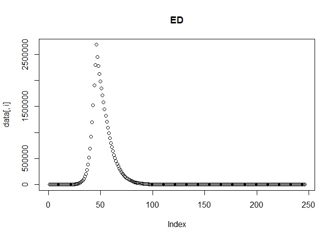<!-- --><!-- --><!-- -->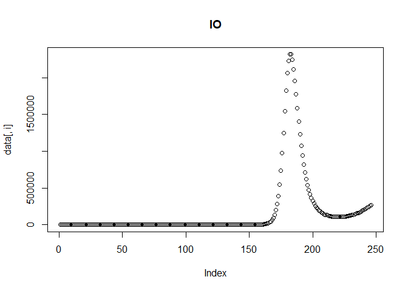<!-- -->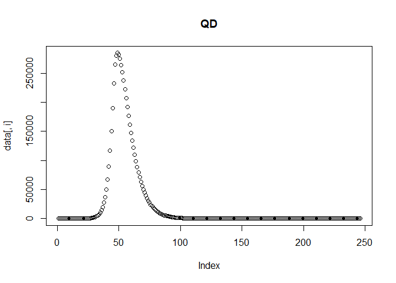<!-- -->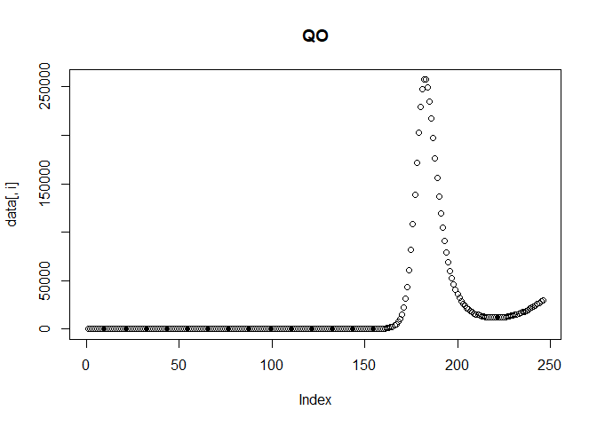<!-- --><!-- --><!-- -->

We can then plot the reported incidence with noise for the Delta and Omicron variants. 


```r
multi_var_sim_inc = calc_sim_incidence_multi_var(
                             ODE_data = multi_var_sim_data,
                             all_dates = all_dates_mv,
                             date_fit_D = date_fit_D,
                             date_fit_O = date_fit_O,
                             rho_D = rho_D,
                             rho_O = rho_O,
                             sigma_D = sigma_D,
                             sigma_O = sigma_O)


multi_var_sim_inc[[2]] # Plot 
```

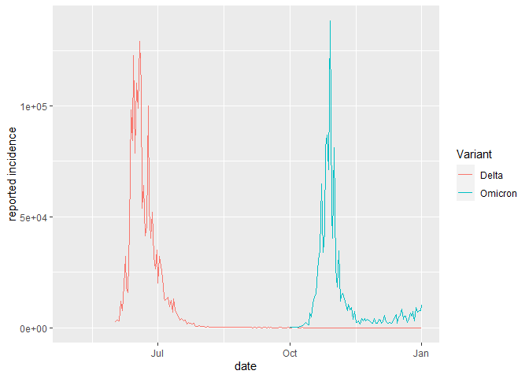<!-- -->

As we are assuming that incidence between July 2021 - October 2021 is Delta and that incidence between October 2021 and December 2021 is Omicron, all other data are "NA" which we need to discard: 


```r
# Removing missing data 
 y_D = multi_var_sim_inc[[1]]$rep_inc_D_noise[!is.na(multi_var_sim_inc[[1]]$rep_inc_D_noise)]
 y_O = multi_var_sim_inc[[1]]$rep_inc_O_noise[!is.na(multi_var_sim_inc[[1]]$rep_inc_O_noise)]
```

# Fitting the multivariant model in Stan 

The multivariate SEIQRS model using Euler's method is coded up in *model2_Euler_V1.stan*, in the *models* folder. Spend some time looking over the model to check everything is clear. The variables for storing the outputs of the E, I, Q compartments are now 2D matrices, where the rows are the each time step at which we solve the model and the columns are the variants. 

Once you are happy with the model, we can fit it to the data:

  

```r
stan_fit_m2_EU1 = run_stan_models(
  list_data =
    list(
      n_var = 2,                                                # no. variants 
      n_ts = length(all_dates_mv),                              # no. time steps 
      n_pop = n_pop,                                            # population  
      n_recov = round(immunity_mv*n_pop),                       # recovered population 
      I0 = c(n_inf_D, n_inf_O),                                 # Seeds 
      y_D = y_D,                                                # Delta reported incidence (data to fit to)
      y_O = y_O,                                                # Omicron reported incidence (data to fit to)
      n_data_D = length(y_D),                                   # no. data 
      n_data_O = length(y_O),                                   # no. data 
      sigma = c(sigma_D,sigma_O),                               # latent rates  
      gamma = c(gamma_D, gamma_O),                              # recovery rate 
      time_seed_O =                                             # index to seed Omicron
        which(all_dates_mv == date_seed_O), 
      time_fit_D = 
         which(all_dates_mv == date_fit_D),                     # index to fit Delta 
      time_fit_O = 
         which(all_dates_mv == date_fit_O),                     # index to fit Omicron 
      time_int_start = which(all_dates_mv == date_int[1]),      # index to start interventions
      time_int_end = which(all_dates_mv == date_int[2]),        # index to end interventions
      scale_time_step = 6,                                      # amount to reduce time step,
      nu  = nu
    ), 
  model = m2_EU1,
  n_var = 2,
  model_no = 2,
  n_iter = 400,
  n_warmup = 200
)
```

```
## Warning: The largest R-hat is NA, indicating chains have not mixed.
## Running the chains for more iterations may help. See
## https://mc-stan.org/misc/warnings.html#r-hat
```

```
## Warning: Bulk Effective Samples Size (ESS) is too low, indicating posterior means and medians may be unreliable.
## Running the chains for more iterations may help. See
## https://mc-stan.org/misc/warnings.html#bulk-ess
```

```
## Warning: Tail Effective Samples Size (ESS) is too low, indicating posterior variances and tail quantiles may be unreliable.
## Running the chains for more iterations may help. See
## https://mc-stan.org/misc/warnings.html#tail-ess
```

```
## Time difference of 8.191365 mins
```

Stan is providing us with a series of warnings that the chains have not mixed and that our posterior distributions are unreliable. To investigate this further, run diagnostics on the model as before: 


```r
m2_EU1_diag = diagnose_stan_fit(
  stan_fit_m2_EU1, #
  pars = c("beta[1]", "rho[1]","rho[2]", "beta[2]", "R_0[1]", "R_0[2]", "epsilon", "omega"))
```

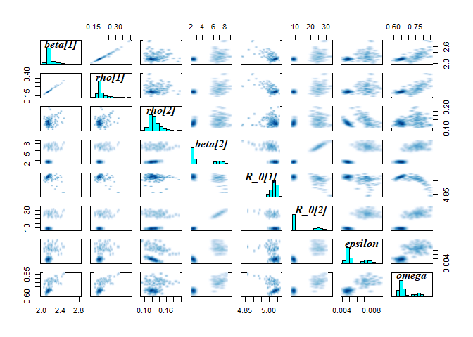<!-- -->

```r
m2_EU1_diag
```

```
## $`markov chain trace plots`
```

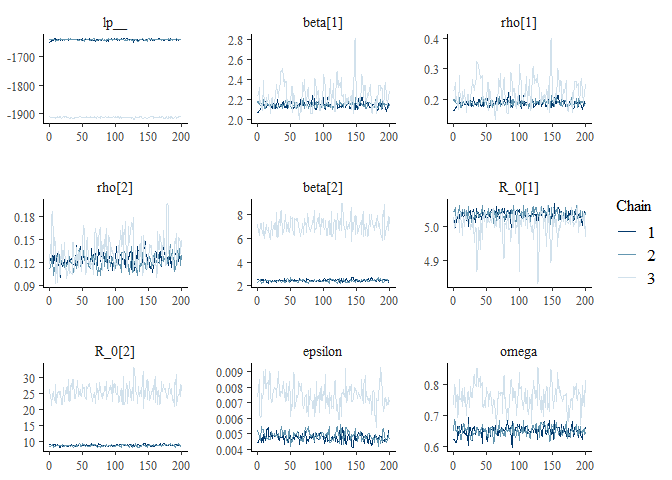<!-- -->

```
## 
## $`univariate marginal posterior distributions`
```

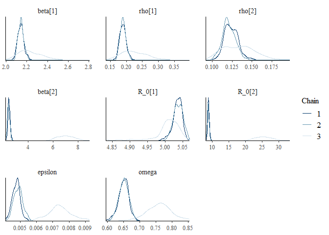<!-- -->

```
## 
## $`summary statistics of parameters`
##                 mean     se_mean          sd        2.5%         25%
## beta[1]  2.174278594 0.032742915 0.086212251 2.076230820 2.126329648
## rho[1]   0.201609983 0.012991698 0.030939623 0.167216827 0.184687568
## rho[2]   0.126246817 0.003388824 0.014708580 0.103874931 0.116838378
## beta[2]  3.971081625 1.781548465 2.210453651 2.271054659 2.402496851
## R_0[1]   5.026515710 0.010703291 0.027965750 4.957186757 5.017956338
## R_0[2]  14.417304447 6.391065805 7.932560673 8.433757470 8.816767533
## epsilon  0.005681398 0.001027253 0.001328556 0.004372203 0.004714769
## omega    0.686398775 0.043428414 0.058106890 0.620262206 0.645499375
##                 50%          75%        97.5%     n_eff     Rhat
## beta[1] 2.150393516  2.187886913  2.404599547  6.932714 1.195066
## rho[1]  0.192530698  0.205612432  0.285419766  5.671503 1.235327
## rho[2]  0.123385478  0.132640129  0.163287402 18.838378 1.102571
## beta[2] 2.491639868  6.536477611  8.006769192  1.539457 6.311293
## R_0[1]  5.031984652  5.042884379  5.058545954  6.826817 1.173300
## R_0[2]  9.071625754 23.593396160 28.833707087  1.540566 6.206673
## epsilon 0.004959327  0.007003534  0.008489794  1.672649 3.119356
## omega   0.660125727  0.732646287  0.815256899  1.790224 2.430118
```

The warnings and diagnostic plots all show the model has failed to converge. Looking at the trace plot, it seems the model is converging on the parameters specific to Delta. Conversely, for the parameters relating to Omicron, the model is exploring two different regions of the posterior distribution. 

To help diagnose the problem, we can look at the lp (the log posterior) to try and understand whether the chains are exploring parameter values that are equally likely. Note, that as the lp_ is the log density *up to a constant*, it is not the same as the log likelihood and should not be used to compare models, as the constant from different models are likely to be different. Therefore, the is only useful as a rough indicator for comparing the log posterior of chains within the same model. 

If a model is non-identifiable it means that two values of a parameter are equally likely, for instance because there are two modes in the posterior distribution. In this instance, we would expect to see chains exploring different regions of parameter space and obtaining similar estimates of the log posterior. Conversely, if we see that chains are exploring different parameter values with different log probabilities it suggests one or more of the chains may be stuck in a local mode. 

***Q3: Looking at the trace plots, do you think the model is non-identifiable or that one or more of the chains are stuck in a local mode?***

***A3: From the trace plot, we can see that chains 1 and 2 are exploring a more probable region of parameter values (i.e., they have a high log probability).***


If we plot the model fit against the data, we can see that the model is able to recreate the Delta incidence but only partly captures the Omicron transmission dynamics: 


```r
plot_model_fit_multi_var(
  stan_fit_m2_EU1,
  variable_model = "lambda_days",
  variable_data = "rep_inc_D_noise",
  data = multi_var_sim_inc[[1]])
```

<!-- -->
To explore this further, we can even plot the model fit for each chain separately. This allows us to confirm that the chains with a high log posterior are indeed exploring parameter values that are able to capture the transmission dynamics:


As expected, chains 1 and 2 are able to capture the transmission dynamics of Omicron, whilst chain 3 peaks too early. This makes sense, given that this chain was exploring much higher values of the Omicron $R_0$.


# Improving the Stan model 

From the above diagnostics we can see that the model is having problems converging. One option is to run the model for more iterations, e.g, 2000 iterations with the first 1000 discarded as burn in. In this instance, the model still fails to converge (you can test this if you like, it takes ~30 minutes to run). 

Alternatively, we can take failure to converge as a sign that our model needs improving. In practice it is often likely that our model is missing some key component of the data generating process. In that instance, we would need to revisit the assumptions underlying our model structure and fixed parameter values in order to extend and improve our model. However, as we simulated the data we know that this is not the case. Instead, lets revisit our parameter priors. 


For $\epsilon$, the rate that immunity wanes against Omicron, the model is exploring two models. The first is ~0.005 and the second is ~0.0075, corresponding to immunity last on average for 200 days and 130 days respectively. Based on the diagnostics we ran, we know that an average duration of immunity around 200 days is more likely. We originally assumed $\epsilon \sim ND(0.003,0.001)$: 


```r
eps_prior = rnorm(100000, 0.003,0.001)
quantile(eps_prior, probs=c(0.025,0.25,0.5,0.75,0.975))
```

```
##        2.5%         25%         50%         75%       97.5% 
## 0.001030631 0.002324570 0.003002029 0.003671811 0.004967465
```
In isolation, this prior supports parameter values between 0.001-0.005, or immunity lasting 250-1000 days, and yet in our model the sampler is stuck in a local mode exploring values of immunity <150 days. Clearly, our prior is not regularising our model in the way that we had hoped. Lets try relaxing the prior on $\epsilon$ to see if that helps: $\epsilon \sim Exponential(5)$. 


*model2_Euler_V2.stan* is exactly the same as *model2_Euler_V1.stan* but with the updated prio. We will also increase the frequency with which we solve the ODEs from 6 times per day to 10 times per day, to improve accuracy. 


```r
stan_fit_m2_EU2 = run_stan_models(
  list_data =
    list(
      n_var = 2,                                                # no. variants 
      n_ts = length(all_dates_mv),                              # no. time steps 
      n_pop = n_pop,                                            # population  
      n_recov = round(immunity_mv*n_pop),                       # recovered population 
      I0 = c(n_inf_D, n_inf_O),                                 # Seeds 
      y_D = y_D,                                                # Delta reported incidence (data to fit to)
      y_O = y_O,                                                # Omicron reported incidence (data to fit to)
      n_data_D = length(y_D),                                   # no. data 
      n_data_O = length(y_O),                                   # no. data 
      sigma = c(sigma_D,sigma_O),                               # latent rates  
      gamma = c(gamma_D, gamma_O),                              # recovery rate 
      time_seed_O =                                             # index to seed Omicron
        which(all_dates_mv == date_seed_O), 
      time_fit_D = 
         which(all_dates_mv == date_fit_D),                     # index to fit Delta 
      time_fit_O = 
         which(all_dates_mv == date_fit_O),                     # index to fit Omicron 
      time_int_start = which(all_dates_mv == date_int[1]),      # index to start interventions
      time_int_end = which(all_dates_mv == date_int[2]),        # index to end interventions
      scale_time_step = 10,                                      # amount to reduce time step,
      nu  = nu
    ), 
  model = m2_EU2,
  n_var = 2,
  model_no = 2
)
```

```
## Time difference of 19.98115 mins
```
This time, we received no warnings and the diagnostics all look good:

```r
m2_EU2_diag = diagnose_stan_fit(
  stan_fit_m2_EU2, #
   pars = c("beta[1]", "beta[2]", "rho[1]","rho[2]",  "R_0[1]", "R_0[2]",  "omega", "epsilon"))
```

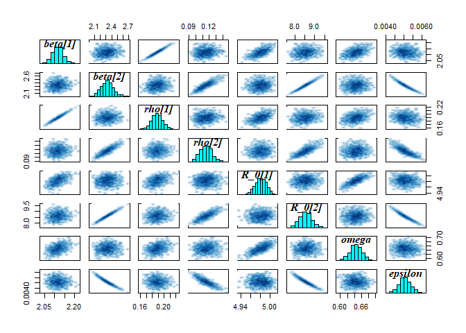<!-- -->

```r
m2_EU2_diag
```

```
## $`markov chain trace plots`
```

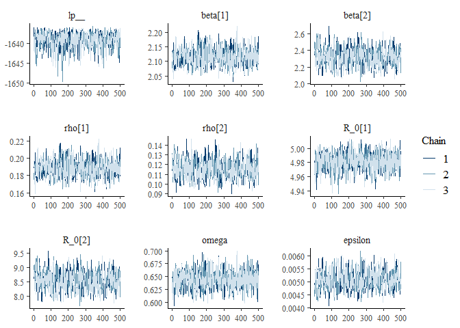<!-- -->

```
## 
## $`univariate marginal posterior distributions`
```

<!-- -->

```
## 
## $`summary statistics of parameters`
##                mean      se_mean           sd        2.5%         25%
## beta[1] 2.116521884 9.899071e-04 0.0269706926 2.067661028 2.097787454
## beta[2] 2.319350471 5.139249e-03 0.1024861769 2.131684601 2.248085267
## rho[1]  0.188317783 3.325335e-04 0.0092349010 0.171366430 0.181847303
## rho[2]  0.115291630 4.347656e-04 0.0090079647 0.099126602 0.108939300
## R_0[1]  4.981323338 4.041932e-04 0.0119813757 4.957105925 4.973470936
## R_0[2]  8.553193796 1.482954e-02 0.3023531775 7.980951894 8.344190297
## omega   0.644320641 5.484722e-04 0.0168800694 0.610813948 0.633733466
## epsilon 0.005078499 1.653904e-05 0.0003368983 0.004422272 0.004848714
##                 50%         75%       97.5%    n_eff      Rhat
## beta[1] 2.116432248 2.133809321 2.175968276 742.3272 1.0010011
## beta[2] 2.320265733 2.385751498 2.542435142 397.6778 1.0132085
## rho[1]  0.188335445 0.194204472 0.207661324 771.2475 1.0012060
## rho[2]  0.115026089 0.121291680 0.134161125 429.2824 1.0127609
## R_0[1]  4.981861544 4.989864744 5.003023951 878.6892 0.9997183
## R_0[2]  8.557859890 8.747650458 9.194714836 415.6939 1.0123018
## omega   0.644341053 0.655534903 0.677306322 947.1947 0.9991738
## epsilon 0.005053239 0.005293894 0.005769865 414.9321 1.0125417
```

The model fit is also good:

```r
plot_model_fit_multi_var(
  stan_fit_m2_EU2,
  variable_model = "lambda_days",
  variable_data = "rep_inc_D_noise",
  data = multi_var_sim_inc[[1]])
```

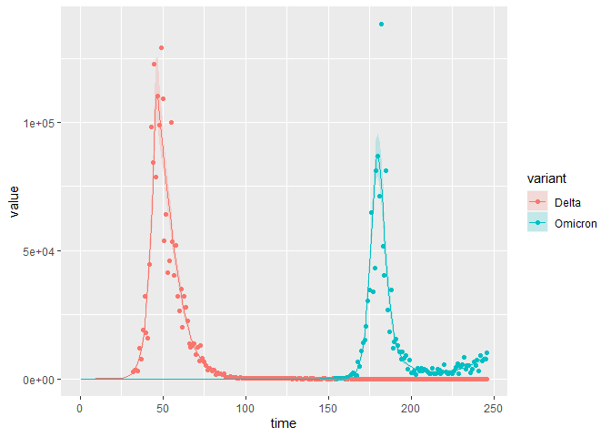<!-- -->


Finally, we can compare the parameter estimates to the true values: 

```r
compare_param_est(
  parameter_names = c("beta[1]", "beta[2]", "rho[1]","rho[2]",  "R_0[1]", "R_0[2]",  "omega", "epsilon"),
  true_param_values = c(beta_D, beta_O, rho_D, rho_O , R0_D, R0_O, omega, epsilon),
  param_values1 =  m2_EU2_diag[[3]][,c(1,4,8)],
  model_names = c("EU")
)
```

```
## [[1]]
```

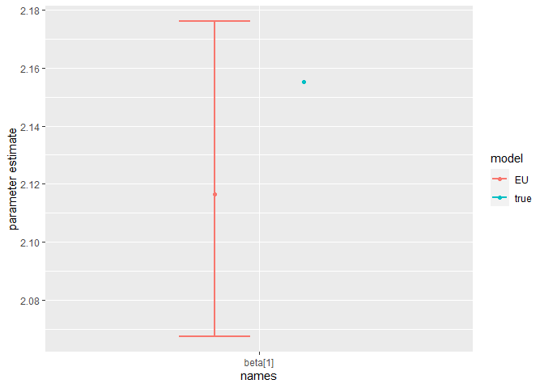<!-- -->

```
## 
## [[2]]
```

<!-- -->

```
## 
## [[3]]
```

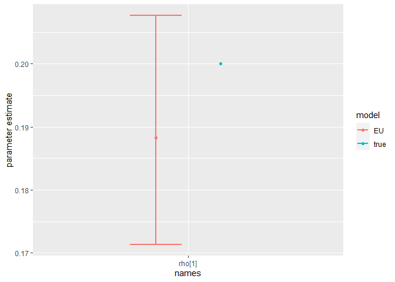<!-- -->

```
## 
## [[4]]
```

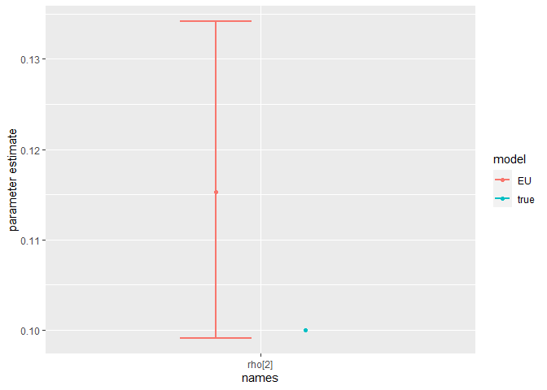<!-- -->

```
## 
## [[5]]
```

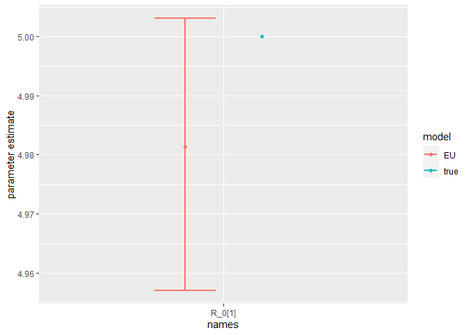<!-- -->

```
## 
## [[6]]
```

<!-- -->

```
## 
## [[7]]
```

<!-- -->

```
## 
## [[8]]
```

<!-- -->

The model is broadly able to capture all the parameter values. As the is strong correlation between the parameters values, we might say they are weakly identified, as the posterior distribution mode is a ridge (see the pairs plot). Nevertheless, with sensible priors we are still able to capture the parameter values and obtain a sufficient sample size (see n_eff), indicating that results are unbiased and can be trusted. 


# Model extensions 

Note, these extensions don't have solutions, and there isn't a single, correct way to approach them. The challanges are more open ended and are provided in case you would like to explore this topic further! 

## 1. Parameter values, priors and likelihoods 

As discussed throughout the tutorial, there are many choices to made during the model fitting process. These include which parameter values to fix and which to estimate, which priors to use and which likelihood to use. 

***Challenge: Refit the model Swap assuming the likelihood follows a Poisson distribution, rather than a Negative Binomial distribution*** 


***Challenge: As discussed above, there is a some non-identifiability in the model. One way to address this is fix one of the parameter values. Refit the model fixing one or more of the parameter values. How does this change the parameter estimates? Alternatively, What happens if you try estimating more parameter values? For instance, try estimating the*** $\gamma$ ***and/or the*** $\sigma$ ***parameters. Does the model still converge? Are the estimated  parameter values less accurate?***
 


***Challenge: We have shown that our model can be sensitive to the choice of prior. We fit the model assuming improper, flat priors. Does the model still converge? Can you find a set of priors that result in divergent transitions? ***

## 2. Missing data 

A common problem in epidemiological modelling is missing data. We are frequently using secondary data, which was not collected for the purposes of our study. When modelling multivariate pathogens (e.g., SARS-CoV-2, Influenza, Dengue), we often do not know what variant or serotype someone was infected with, as this is not routinely collected information. For instance, most positive COVID-19 samples are not sequenced, so we do not know which variant they are infected with. In this example, we made the simplifying assumption that only a single variant was circulating at any time. However, this is clearly incorrect. Instead, we could couple genomic surveillance data, for instance that reported in [GISAID](https://www.gisaid.org/), to the reported epidemiological incidence to recreate the variant specific incidences, by assuming the variant-specific prevalence in GISAID is proportional to its reported incidence: 

$$y_Y = y_{tot} \frac{x_Y}{n}$$
Where $y_Y$ is the variant specific reported incidence, $y_{tot}$ is the total reported incidence, $x_Y$ is the number of sequences positive for variant Y and $n$ is the number of samples sequenced. 

A limitation of genomic surveillance, is that it is often spatiotemporally sparse. Even for SARS-CoV-2, which has had more thorough surveillance than most other infectious diseases, there may be months for which now genomic surveillance was done. For instance, say that no genomic surveillance was undertaken in Gauteng for 1 weeks in June and October respectively. Therefore, for those time period we would have missing data for the variant-specific incidence of Delta and Omicron:     


```r
ggplot(multi_var_sim_inc_missing_data, aes(x = date,y = rep_inc_D_noise)) +
  geom_line() +
  geom_line(aes(y= rep_inc_O_noise), color = "red")
```

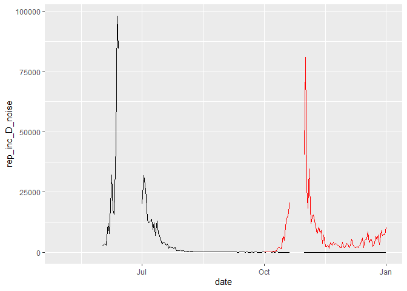<!-- -->


Whereas in R, we can account for missing data as "NA", in Stan missing data cannot be included. Therefore, if we want to fit the model to incidence data where date for certain dates are missing, we need to include an array where we index the dates to be fit. This is similar to seeding the model 1 month prior to fitting, we passed an index to the Stan model telling it at which time point to start fitting the model. 

***Challenge: Save *model2_Euler_V2.stan* as a new model and extend it to fit to the incidence data in *multi_var_sim_inc_missing_data*, accounting for the missing data.***


## 3. Pre-symptomatic transmission

There is evidence that SARS-CoV-2 transmission occurs prior to the onset of symptoms [3], which we do not account for in our model. 

***Challenge: First draw out a compartmental model which allows for pre-symptomatic infectiousness. Assume that the average period from exposure to SARS-CoV-2 to the onset of Viraemia is fixed at 1.31 days [3] (so you do not need to estimate any additional parameters). Next, save *model2_deSolve.R*  as a new model and extend it to include pre-symptomatic infectiousness. How does it change the transmission dynamics of the outbreak? Fianlly, save *model2_Euler_V2.stan* as a new model and modify it to include pre-symptomatic infectiousness.***  

# References 
- (1) Mutevedzi PC, Kawonga M, Kwatra G, et al. Estimated SARS-CoV-2 infection rate and fatality risk in Gauteng Province, South Africa: a population-based seroepidemiological survey. Int J Epidemiol 2022; 51(2): 404-17.
- (2) Tanaka H, Ogata T, Shibata T, et al. Shorter Incubation Period among COVID-19 Cases with the BA.1 Omicron Variant. Int J Environ Res Public Health 2022; 19(10).
- (3) Lavezzo E, Franchin E, Ciavarella C, et al. Suppression of a SARS-CoV-2 outbreak in the Italian municipality of Vo’. Nature 2020; 584(7821): 425-9.
- (4) Grant R, Charmet T, Schaeffer L, et al. Impact of SARS-CoV-2 Delta variant on incubation, transmission settings and vaccine effectiveness: Results from a nationwide case-control study in France. Lancet Reg Health Eur 2022; 13: 100278
- (5) Menni C, Valdes AM, Polidori L, et al. Symptom prevalence, duration, and risk of hospital admission in individuals infected with SARS-CoV-2 during periods of omicron and delta variant dominance: a prospective observational study from the ZOE COVID Study. Lancet 2022; 399(10335): 1618-24.
